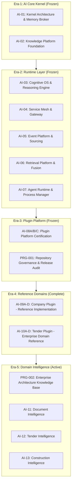

# ARCH-INDEX-001: Master Enterprise Architecture Index
## TeamTender Enterprise Platform — Eras 1 through 4

> **Program:** PRG-002 Enterprise Architecture Knowledge Base  
> **Status:** 🔒 FROZEN / CERTIFIED PLATFORM INDEX  
> **Date:** 2026-07-29

---

## 1. Program & Roadmap Structure

---

## 2. Platform Architecture Artifact Directory

### Era-1: AI Core Kernel & Memory Broker
- **Core Specification:** `backend/docs/ai/kernel/v1.0/`
- **Key Artifacts:**
  - `ADR-001.md`: AI Core Kernel Architecture & Memory Broker Protocol
  - `RFC-001.md`: Kernel Subsystem Interfaces & Memory Storage Contract
  - `CAT-001.md`: Kernel Capabilities Catalog
  - `SPEC-001.md`: Kernel Formal Specification
  - `INDEX.md`: Subsystem Cross-Reference Index
- **Status:** 🔒 Frozen

### Era-2: Runtime Layer & Subsystems
- **Cognitive OS:** `backend/docs/ai/runtime/v1.0/` (`ADR-002.md`, `RFC-002.md`, `SPEC-002.md`)
- **Service Mesh:** `backend/docs/ai/runtime/v1.0/` (`ADR-003.md`, `RFC-003.md`, `VISION-002.md`)
- **Event Platform:** `backend/docs/ai/runtime/v1.0/` (`ADR-004.md`, `RFC-004.md`)
- **Retrieval Platform:** `backend/docs/ai/runtime/v1.0/` (`ADR-005.md`, `PERF-003.md`)
- **Agent Runtime:** `backend/docs/ai/runtime/v1.0/` (`ADR-006.md`, `SPEC-003.md`)
- **Status:** 🔒 Frozen

### Era-3: Plugin Platform & Governance
- **Plugin Host & SDK:** `backend/docs/ai/plugins/v1.0/platform/` (`BLUEPRINT-AI-08C.md`, `PLUGIN_COMPLIANCE_PROGRAM.md`)
- **Repository Governance:** `docs/project/audit/` (`AUDIT-001 Repository Audit Report.md`, `AUDIT-003 Release Audit Report.md`, `GOVERNANCE_RULES.md`)
- **Status:** 🔒 Frozen

### Era-4: Reference Domains (Company & Tender Plugins)
- **Company Plugin (Reference Implementation):** `backend/docs/ai/plugins/v1.0/company-certification/` (`ai-09d/RPT-AI09D-01` to `09`, `SDK_COMPLIANCE_AUDIT.md`)
- **Tender Plugin (Enterprise Domain Reference):** `backend/docs/ai/plugins/v1.0/tender/`
  - Design Packages: `AI-10B-PKG-A-Domain-Design.md`, `AI-10B-PKG-B-Intelligence-Design.md`, `AI-10B-PKG-C-Integration-Design.md`, `AI-10B-PKG-D-Runtime-Design.md`
  - Governance: `ADR-TENDER-001.md`, `RFC-TENDER-001.md`
  - Certification Suite (17 docs): `certification/CERT-001` through `CERT-005`, `PERF-001` through `PERF-005`, `SEC-001` through `SEC-005`, `QUAL-001` through `QUAL-005`
- **Status:** 🔒 Certified (Golden Reference)

---

## 3. Specification Index

1. **`SPEC-001`**: AI Core Kernel Specification
2. **`SPEC-002`**: Cognitive OS Specification
3. **`SPEC-003`**: Agent Runtime Process Manager Specification
4. **`SPEC-DOMAIN-PLUGIN-v1.3`**: TeamTender Enterprise Domain Plugin Specification (Locks 25–52)
