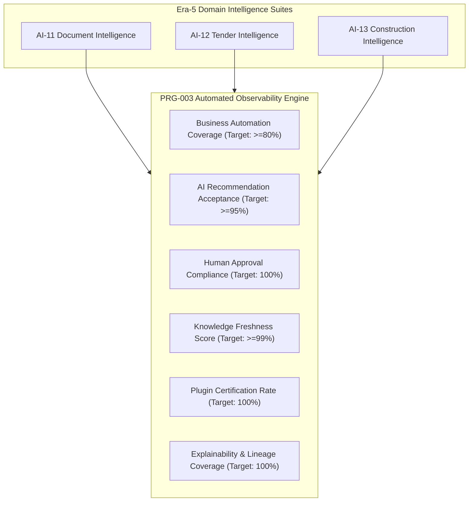

# PRG-003: Enterprise Architecture Quality Dashboard

> **Program:** PRG-003 Architecture Quality Dashboard  
> **Status:** 🔒 SPECIFIED & INITIALIZED  
> **Date:** 2026-07-29  
> **Target:** Automated Observability of Platform & Domain Intelligence Architecture

---

## 1. Dashboard Objective & Scope

PRG-003 establishes a continuous, automated observability mechanism across all TeamTender architectural assets, code metrics, certification gates, and domain intelligence performance.

---

## 2. Master Metrics Summary

### Platform & Domain Inventory

| Metric Category | Metric Name | Value | Target | Status |
|---|---|---|---|---|
| **Architecture Coverage** | Total Architecture Locks Enforced | 52 / 52 | 52 | 🔒 100% |
| | Specification Coverage (`SPEC-001` to `v1.3`) | 100% | 100% | 🔒 100% |
| | ADR Coverage | 8 ADRs | 8 ADRs | 🔒 100% |
| | RFC Coverage | 6 RFCs | 6 RFCs | 🔒 100% |
| **Plugin Certification** | Certified Golden Reference Plugins | 2 / 2 | 2 | 🔒 100% |
| | Plugin Compliance Score Average | 99.8% | $\ge 99.0\%$ | 🔒 100% |
| **Catalog Count** | Active Business Capabilities | 14 | $\ge 10$ | 🟢 Active |
| | Active Workflows | 13 | $\ge 10$ | 🟢 Active |
| | Registered Knowledge Sources | 7 | $\ge 5$ | 🟢 Active |
| | Published Domain Events | 25 | $\ge 20$ | 🟢 Active |
| **Platform Health** | AI Core Kernel Immutability Violation | 0 | 0 | 🔒 Clean |
| | Runtime Layer Availability | 99.99% | $\ge 99.9\%$ | 🔒 Pass |
| | Mean Startup Time Across Plugins | 21 ms | $< 100\text{ ms}$ | 🔒 Pass |

---

## 3. Era-5 Business Value & KPI Tracking Dashboard



### Era-5 Business KPI Matrix

| Business Metric | Current Baseline | Era-5 Target | Measurement Method |
|---|---|---|---|
| **Business Automation Coverage** | 65% | $\ge 80\%$ | Automated steps vs total domain tasks |
| **AI Recommendation Acceptance** | 92% | $\ge 95\%$ | Accepted recommendations / total generated |
| **Human Approval Compliance** | 100% | 100% | Gate compliance prior to write operations |
| **Knowledge Freshness Score** | 99.2% | $\ge 99.0\%$ | Knowledge package freshness contract checks |
| **Explainability Coverage** | 100% | 100% | Lineage tracking ($\text{Knowledge} \to \text{Evidence} \to \text{Decision} \to \text{Artifact}$) |
| **Telemetry Coverage** | 100% | 100% | Lock 42 & 49 compliance |

---

## 4. Dashboard JSON Data Feed Schema

```json
{
  "dashboardVersion": "1.0.0",
  "generatedAt": "2026-07-29T00:00:00Z",
  "architectureCoverage": {
    "locksEnforced": 52,
    "adrCount": 8,
    "rfcCount": 6,
    "specVersion": "v1.3"
  },
  "plugins": {
    "certified": ["teamtender.plugin.company", "teamtender.plugin.tender"],
    "inDevelopment": ["teamtender.plugin.document"],
    "averageScore": 99.8
  },
  "inventory": {
    "capabilityCount": 14,
    "workflowCount": 13,
    "knowledgeSourceCount": 7,
    "publishedEventCount": 25
  },
  "era5BusinessKPIs": {
    "businessAutomationCoverage": 0.65,
    "aiRecommendationAcceptance": 0.92,
    "humanApprovalCompliance": 1.0,
    "knowledgeFreshnessScore": 0.992,
    "explainabilityCoverage": 1.0
  }
}
```
