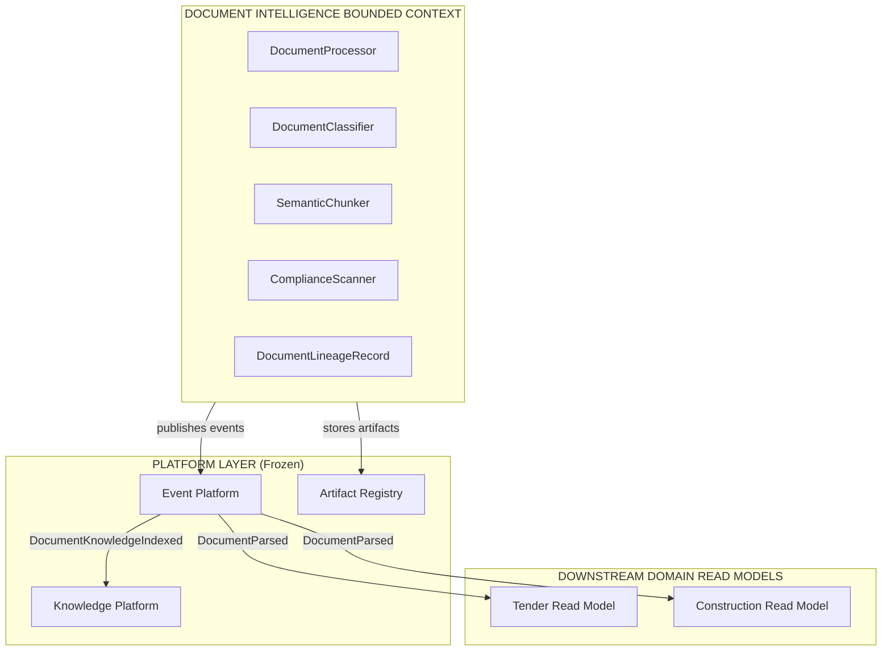
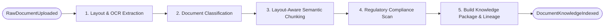
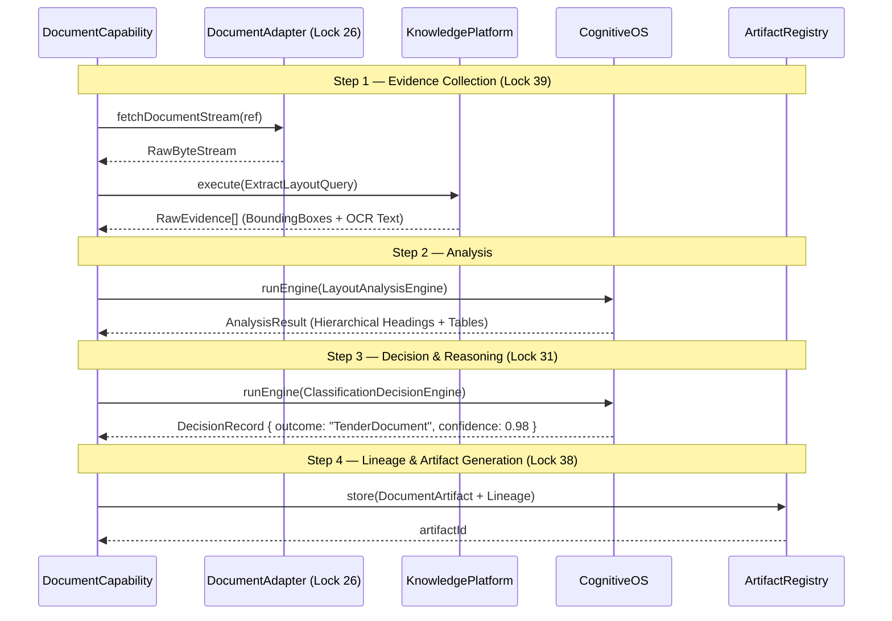

# BLUEPRINT-AI11: Document Intelligence Blueprint

> **Program:** AI-11 Document Intelligence  
> **Phase:** Blueprint  
> **Sprint:** AI-11A  
> **Status:** 🟢 PROPOSED  
> **Standard:** SPEC-DOMAIN-PLUGIN-v1.3 (Locks 25 – 52)

---

## 1. Domain Bounded Context & Architecture



---

## 2. Capability Matrix (Lock 27 & Lock 36)

| Semantic ID | Version | Lifecycle | Input | Output | Artifact Produced (Lock 32) |
|---|---|---|---|---|---|
| `document.ocr.extract` | v1.0.0 | `ACTIVE` | `RawDocumentRef` | `ExtractedLayoutData` | `LayoutArtifact` |
| `document.classifier.classify` | v1.0.0 | `ACTIVE` | `ExtractedLayoutData` | `ClassificationResult` | `ClassificationArtifact` |
| `document.semantic.chunk` | v1.0.0 | `ACTIVE` | `ExtractedLayoutData` | `SemanticChunkPackage` | `KnowledgePackageArtifact` |
| `document.compliance.scan` | v1.0.0 | `ACTIVE` | `SemanticChunkPackage` | `DocumentComplianceReport` | `ComplianceReportArtifact` |

---

## 3. Workflow DAGs (Lock 28 Determinism & Lock 37 Versioning)

### Document Ingestion Workflow (`document.workflow.ingestion@v1.0.0`)



---

## 4. Evidence-First Execution Sequence (Lock 39)



---

## 5. Domain Manifest Declaration v2.2 (Lock 35)

```json
{
  "id": "teamtender.plugin.document",
  "version": "1.0.0",
  "manifestVersion": "2.2",
  "type": "Domain",
  "domain": "Document Intelligence",
  "capabilities": [
    { "semanticId": "document.ocr.extract", "version": "1.0.0", "lifecycle": "ACTIVE", "enabled": true },
    { "semanticId": "document.classifier.classify", "version": "1.0.0", "lifecycle": "ACTIVE", "enabled": true },
    { "semanticId": "document.semantic.chunk", "version": "1.0.0", "lifecycle": "ACTIVE", "enabled": true },
    { "semanticId": "document.compliance.scan", "version": "1.0.0", "lifecycle": "ACTIVE", "enabled": true }
  ],
  "knowledgeSources": [
    { "id": "document.knowledge.ocr-cache", "type": "Structured", "freshness": "24h" }
  ],
  "workflows": [
    { "id": "document.workflow.ingestion", "version": "1.0.0", "deterministic": true }
  ],
  "events": {
    "published": ["DocumentUploaded", "DocumentParsed", "DocumentClassified", "DocumentKnowledgeIndexed"],
    "consumed": []
  },
  "sla": {
    "startupTimeMs": 100,
    "healthCheckTimeMs": 10,
    "maxMemoryMb": 512,
    "maxCpuTimeMs": 10000,
    "maxConcurrentAgents": 3,
    "expectedResponseTimeMs": 500
  }
}
```

---

## 6. Verification & Certification Plan (Lock 46)

- **Automated Harness:** Run `PluginRuntimeValidator` against `teamtender.plugin.document`.
- **Benchmark Target:** Process 50-page PDF layout extraction in $< 5\text{ seconds}$.
- **Compliance Check:** Verify 100% compliance with SPEC-DOMAIN-PLUGIN-v1.3 (Locks 25–52).
