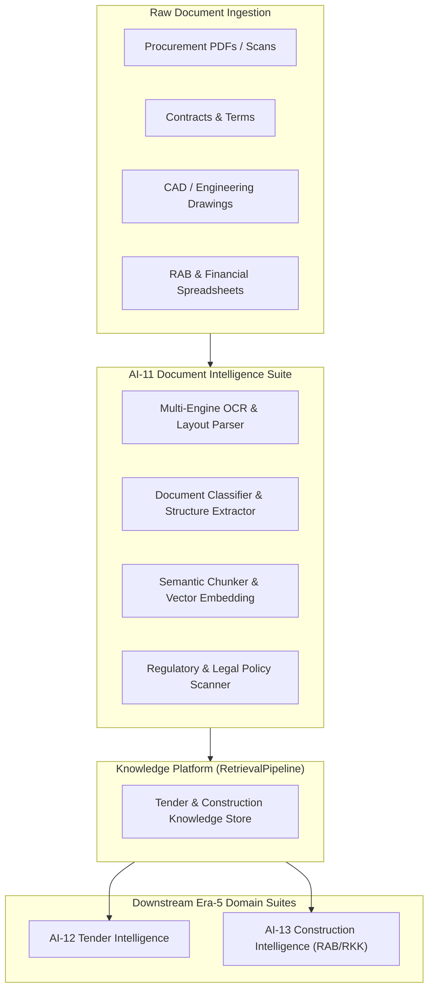

# VISION-AI11: Document Intelligence Strategic Vision

> **Program:** AI-11 Document Intelligence  
> **Phase:** Vision  
> **Sprint:** AI-11A  
> **Status:** 🟢 PROPOSED  
> **Target:** Universal Knowledge Ingestion & Document Intelligence Foundation for TeamTender

---

## 1. Strategic Objective

Document Intelligence (AI-11) is the foundational domain intelligence suite of Era-5. While Tender Plugin (AI-10) established the enterprise domain orchestration reference, **Document Intelligence provides the multi-modal document extraction, layout understanding, OCR, classification, and semantic chunking engines that feed knowledge into all downstream domains** (Tender, RAB, RKK, Construction Intelligence).

---

## 2. Core Value Proposition & Business Impact

| Metric | Current Manual Baseline | AI-11 Target | Value Impact |
|---|---|---|---|
| **Document Processing Time** | 4.5 hours / document | $< 30\text{ seconds}$ | **$90\%$ time reduction** |
| **Table & Specs Extraction Accuracy** | 78% (human error) | $\ge 98\%$ | Elimination of costly estimation errors |
| **RAG Retrieval Precision** | 65% (naive chunking) | $\ge 94\%$ (layout-aware chunking) | Highly accurate AI context generation |
| **Business Automation Coverage** | 35% | $\ge 80\%$ | Fully automated ingestion pipeline |

---

## 3. Scope & Component Breakdown

Document Intelligence delivers 4 core capabilities adhering strictly to SPEC-DOMAIN-PLUGIN-v1.3:

1. **`document.ocr.extract`**: Multi-modal layout analysis, table extraction, and OCR text extraction for native and scanned PDFs/images.
2. **`document.classifier.classify`**: Automated classification into document types (Tender Document, Technical Specification, Bill of Quantities, Contract, Safety Plan).
3. **`document.semantic.chunk`**: Layout-aware semantic chunking preserving table structures, clauses, and hierarchical headings.
4. **`document.compliance.scan`**: Automated scan against legal, regulatory, and technical compliance rules.

---

## 4. Architectural Guarantees (Domain Plugin Standard v1.3)

- **Platform Core Protection (Lock 47):** Zero changes to AI Core Kernel, Runtime Layer, or Plugin Platform.
- **Evidence First (Lock 39):** Layout elements and OCR blocks are treated as raw Evidence before any classification or decision.
- **Read Model Isolation (Lock 25):** Emits `DocumentParsed` and `DocumentKnowledgeIndexed` events for ingestion into Read Models.
- **Explainability (Lock 50):** Extracted clauses maintain bounding-box coordinates and line numbers linked to raw documents.
