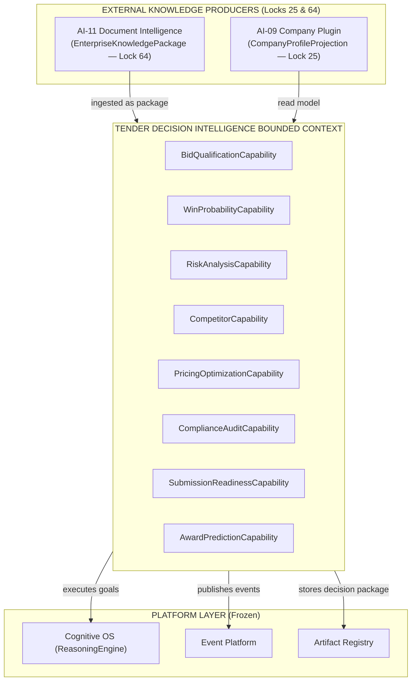

# BLUEPRINT-AI12: Tender Decision Intelligence Technical Blueprint

> **Program:** AI-12 Tender Intelligence  
> **Phase:** Blueprint  
> **Sprint:** AI-12A  
> **Status:** 🟢 PROPOSED  
> **Standard:** SPEC-DOMAIN-PLUGIN-v1.3 (Locks 25 – 64)

---

## 1. Domain Bounded Context Map



---

## 2. Decision Capability Matrix (Lock 27 & Lock 36)

| Semantic ID | Version | Lifecycle | Input | Output | Artifact Produced (Lock 32) |
|---|---|---|---|---|---|
| `tender.decision.qualify` | v1.0.0 | `ACTIVE` | `EnterpriseKnowledgePackage + CompanyProjection` | `QualificationDecision` | `QualificationArtifact` |
| `tender.decision.win-probability` | v1.0.0 | `ACTIVE` | `QualificationDecision + HistoricalBids` | `WinProbabilityResult` | `WinProbabilityArtifact` |
| `tender.decision.risk-analyze` | v1.0.0 | `ACTIVE` | `EnterpriseKnowledgePackage` | `RiskAnalysisReport` | `TenderRiskArtifact` |
| `tender.decision.competitor-analyze` | v1.0.0 | `ACTIVE` | `TenderId + MarketData` | `CompetitorIntelligenceReport` | `CompetitorArtifact` |
| `tender.decision.pricing-optimize` | v1.0.0 | `ACTIVE` | `RiskReport + MarketPricing` | `OptimizedPricingStrategy` | `PricingStrategyArtifact` |
| `tender.decision.compliance-audit` | v1.0.0 | `ACTIVE` | `BidDraftPackage` | `ComplianceAuditReport` | `ComplianceAuditArtifact` |
| `tender.decision.submission-readiness` | v1.0.0 | `ACTIVE` | `BidPackage` | `ReadinessAssessment` | `ReadinessArtifact` |
| `tender.decision.award-predict` | v1.0.0 | `ACTIVE` | `FinalBidPackage` | `AwardPredictionResult` | `AwardPredictionArtifact` |

---

## 3. Decision Workflow DAG (`tender.workflow.decision-pipeline@v1.0.0`)

```mermaid
graph LR
    START([EnterpriseKnowledgePackageIngested]) --> A[1. Bid Qualification]
    A --> B[2. Risk Analysis]
    B --> C[3. Competitor Analysis]
    C --> D[4. Pricing Strategy Optimization]
    D --> E[5. Win Probability Assessment]
    E --> F[6. Compliance Risk Audit]
    F --> G[7. Submission Readiness Check]
    G --> H[8. Human Approval Gate]
    H --> END([BidDecisionPackageFinalized])
```



---

## 4. Universal Document & Package Integration (Locks 59 & 64)

```typescript
// Integration Schema in AI-12 Capabilities
interface IngestedEnterpriseKnowledgePackage {
    metadata: {
        documentIdentity: UniversalDocumentIdentity; // Lock 59
        provenance: DocumentProvenance;              // Lock 62
        fingerprint: DocumentFingerprint;            // Lock 57
    };
    evidenceSet: MultiModalEvidence[];               // Lock 54
    citations: SemanticCitation[];                   // Lock 58
    knowledgeNodes: KnowledgeNode[];
    crossDocumentRelationships: CrossDocRelation[];  // Lock 60
    confidenceAggregation: ConfidencePackage;        // Lock 63
}
```

---

## 5. Domain Manifest Declaration v2.2 (Lock 35 & Lock 45 SLA)

```json
{
  "id": "teamtender.plugin.tender-intelligence",
  "version": "1.0.0",
  "manifestVersion": "2.2",
  "type": "Domain",
  "domain": "Tender Decision Intelligence",
  "capabilities": [
    { "semanticId": "tender.decision.qualify", "version": "1.0.0", "lifecycle": "ACTIVE", "enabled": true },
    { "semanticId": "tender.decision.win-probability", "version": "1.0.0", "lifecycle": "ACTIVE", "enabled": true },
    { "semanticId": "tender.decision.risk-analyze", "version": "1.0.0", "lifecycle": "ACTIVE", "enabled": true },
    { "semanticId": "tender.decision.competitor-analyze", "version": "1.0.0", "lifecycle": "ACTIVE", "enabled": true },
    { "semanticId": "tender.decision.pricing-optimize", "version": "1.0.0", "lifecycle": "ACTIVE", "enabled": true },
    { "semanticId": "tender.decision.compliance-audit", "version": "1.0.0", "lifecycle": "ACTIVE", "enabled": true },
    { "semanticId": "tender.decision.submission-readiness", "version": "1.0.0", "lifecycle": "ACTIVE", "enabled": true },
    { "semanticId": "tender.decision.award-predict", "version": "1.0.0", "lifecycle": "ACTIVE", "enabled": true }
  ],
  "workflows": [
    { "id": "tender.workflow.decision-pipeline", "version": "1.0.0", "deterministic": true }
  ],
  "events": {
    "published": [
      "BidQualificationCompleted", "RiskAnalysisCompleted", "PricingOptimized",
      "WinProbabilityCalculated", "ComplianceAudited", "SubmissionReadinessVerified",
      "AwardPredicted", "BidDecisionPackageFinalized"
    ],
    "consumed": [
      "DocumentKnowledgeIndexed", "CompanyProfileUpdated"
    ]
  },
  "sla": {
    "startupTimeMs": 100,
    "healthCheckTimeMs": 10,
    "maxMemoryMb": 512,
    "maxCpuTimeMs": 10000,
    "maxConcurrentAgents": 3,
    "expectedResponseTimeMs": 500
  }
}
```

---

## 6. Verification & Certification Plan (Lock 46)

- **Automated Validation:** Run `PluginRuntimeValidator` against `teamtender.plugin.tender-intelligence`.
- **Decision Reproducibility:** Verify 100% of decision output packages produce exact `ReasoningRecord` and verifiable `SemanticCitation` references (Locks 31 & 58).
- **Zero Kernel Impact:** Static import check to ensure zero kernel bypass.
