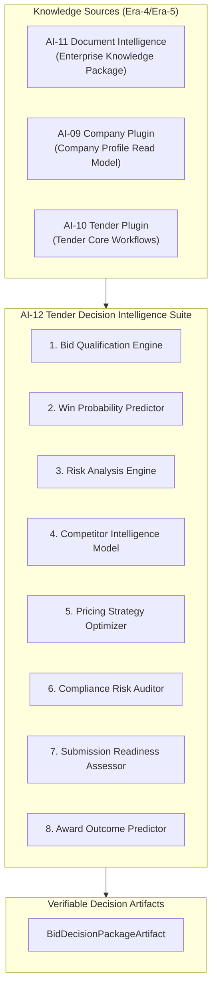
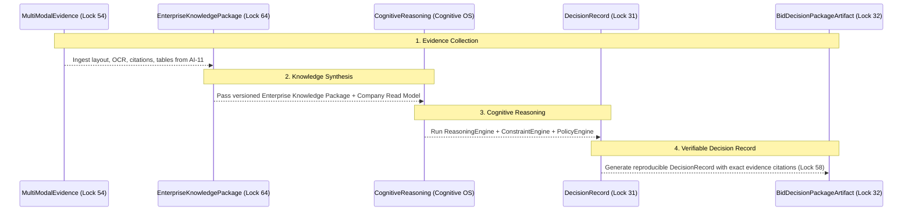

# VISION-AI12: Tender Decision Intelligence Strategic Vision

> **Program:** AI-12 Tender Intelligence  
> **Subsystem:** Tender Decision Intelligence Suite  
> **Phase:** Vision  
> **Sprint:** AI-12A  
> **Status:** 🟢 PROPOSED  
> **Target:** Enterprise Decision Intelligence Engine for Procurement & Bidding

---

## 1. Strategic Objective

While Tender Plugin (AI-10) established the enterprise domain reference for tender operations, **AI-12 Tender Intelligence transforms the platform from a tender analyzer into a Tender Decision Intelligence Suite.**

Instead of returning unverified LLM opinions, AI-12 executes rigorous, evidence-backed decision engineering across 8 critical procurement decisions:

---

## 2. Core Execution Model: Evidence-to-Decision Pipeline

AI-12 enforces the strict decision sequence mandated by executive direction:

$$\text{Evidence} \longrightarrow \text{Knowledge} \longrightarrow \text{Reasoning} \longrightarrow \text{Decision} \longrightarrow \text{Artifact}$$

---

## 3. The 8 Decision Intelligence Engines

1. **Bid Qualification Engine (`tender.decision.qualify`):** Evaluates company eligibility, capacity, and financial thresholds against tender requirements.
2. **Win Probability Predictor (`tender.decision.win-probability`):** Calculates empirical win probability based on historical bids, pricing competitiveness, and company trust score.
3. **Risk Analysis Engine (`tender.decision.risk-analyze`):** Detects legal, contractual, technical, and penalty risks embedded in tender documents.
4. **Competitor Intelligence Model (`tender.decision.competitor-analyze`):** Analyzes market competitors' historical bidding patterns and pricing behavior.
5. **Pricing Strategy Optimizer (`tender.decision.pricing-optimize`):** Recommends optimal bid pricing balancing margin optimization with win probability.
6. **Compliance Risk Auditor (`tender.decision.compliance-audit`):** Scans bid proposal against mandatory technical and administrative requirements.
7. **Submission Readiness Assessor (`tender.decision.submission-readiness`):** Verifies all required documents, signatures, stamps, and attachments before submission.
8. **Award Outcome Predictor (`tender.decision.award-predict`):** Predicts post-opening evaluation rankings and final award outcome.

---

## 4. Key Performance Indicators (Era-5 Executive KPIs)

| Executive KPI | Target | Measurement |
|---|---|---|
| **Evidence Coverage** | 100% | % decision factors backed by evidence |
| **Citation Integrity** | 100% | % citations resolving to original evidence (Lock 61) |
| **Knowledge Traceability** | 100% | % knowledge nodes linked to document lineage (Lock 53) |
| **Decision Explainability** | 100% | % decisions with complete `ReasoningRecord` (Lock 31) |
| **Cross-document Accuracy** | $\ge 98\%$ | Accuracy of addendum & clarification resolution (Lock 60) |
| **Duplicate Knowledge Rate** | $\le 1\%$ | Deduplication efficacy (Lock 57 Fingerprint) |
| **Knowledge Freshness** | $\ge 99\%$ | Freshness contract compliance (Lock 44) |
| **Human Approval Compliance** | 100% | % decisions gated by human approval prior to submission |
