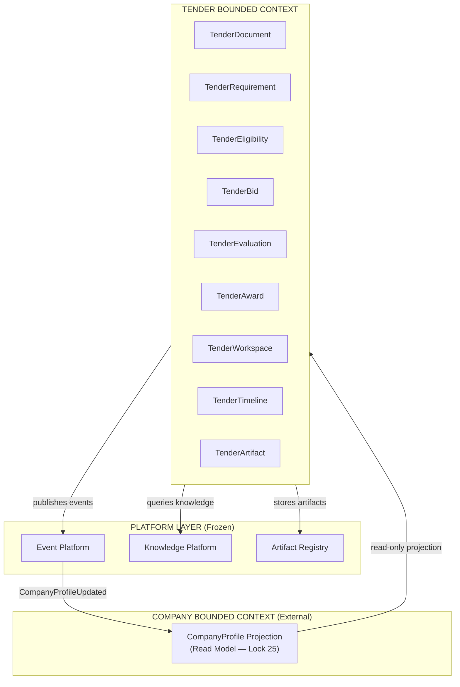
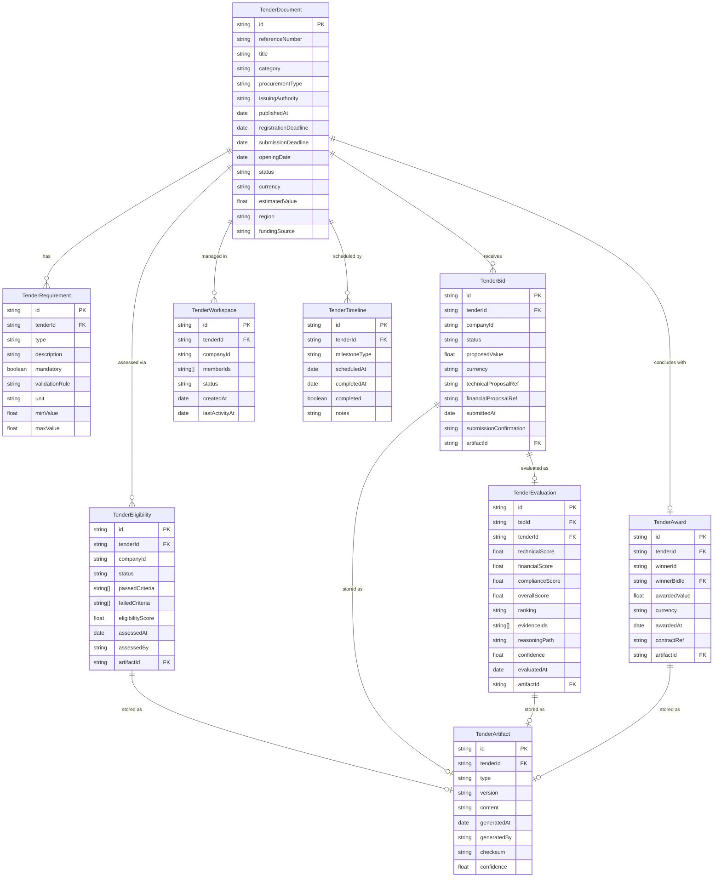
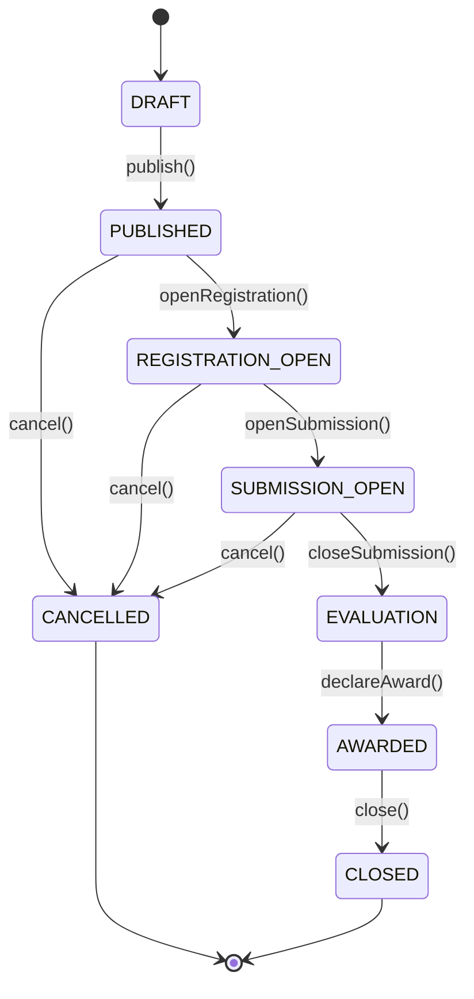
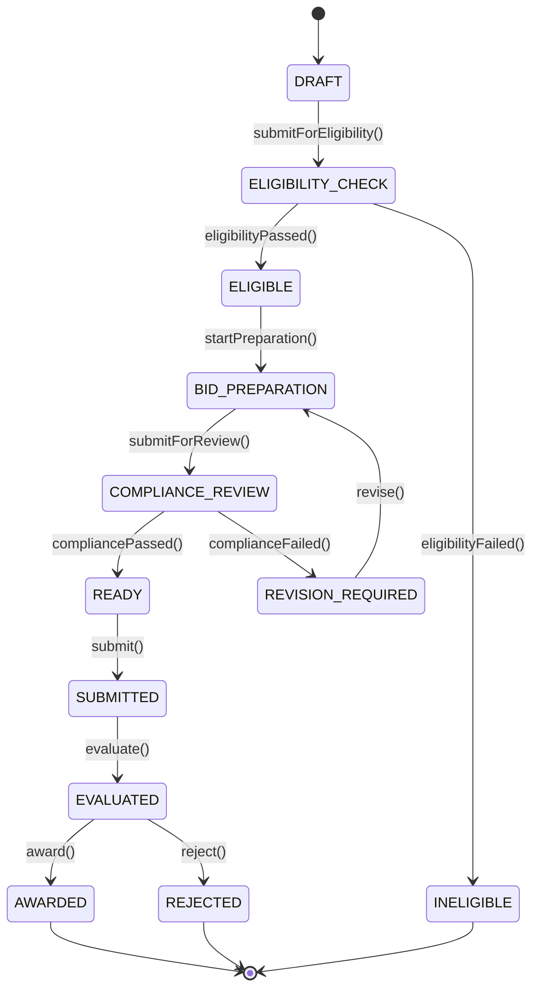

# AI-10B Package A — Domain Design
## Tender Plugin — Domain Architecture

> **Package:** A — Domain  
> **Sprint:** AI-10B: Tender Plugin Domain Design  
> **Status:** 🟢 APPROVED (AI-10A)  
> **Architecture Locks:** Lock 25 (Domain Read Models), Lock 28 (Workflow Determinism), Lock 32 (Tender Artifact), Lock 33 (Zero Domain Leakage)

---

## A.1 — Bounded Context Map



---

## A.2 — ER Diagram



---

## A.3 — Aggregate Design

### Aggregate: TenderDocument (Aggregate Root)
```text
TenderDocument (Aggregate Root)
    ├── id: TenderId (Value Object)
    ├── referenceNumber: ReferenceNumber (VO)
    ├── category: TenderCategory (Enum)
    ├── requirements: TenderRequirement[] (Entity List)
    ├── timeline: TenderTimeline (Entity)
    ├── eligibilityRules: EligibilityRule[] (VO List)
    └── status: TenderStatus (State Machine)
```

### Aggregate: TenderBid (Aggregate Root)
```text
TenderBid (Aggregate Root)
    ├── id: BidId (VO)
    ├── tenderId: TenderId (VO — cross-ref)
    ├── companyId: CompanyId (VO — from Read Model Projection)
    ├── proposedValue: Money (VO)
    ├── technicalProposal: ProposalRef (VO)
    ├── financialProposal: ProposalRef (VO)
    ├── status: BidStatus (State Machine)
    └── artifacts: TenderArtifact[] (Entity List)
```

### Aggregate: TenderEvaluation (Aggregate Root)
```text
TenderEvaluation (Aggregate Root)
    ├── id: EvaluationId (VO)
    ├── bidId: BidId (VO)
    ├── scores: EvaluationScore (VO)
    │   ├── technical: float
    │   ├── financial: float
    │   └── compliance: float
    ├── reasoning: ReasoningRecord (VO — Lock 31)
    │   ├── evidence: Evidence[]
    │   ├── appliedRules: Rule[]
    │   ├── appliedPolicies: Policy[]
    │   ├── constraintResults: Constraint[]
    │   ├── reasoningPath: string[]
    │   └── confidence: float
    └── artifact: TenderArtifact (Entity)
```

### Read Model: CompanyProfileProjection (Lock 25)
```text
CompanyProfileProjection (Read Model — NOT an Aggregate)
    ├── companyId: string
    ├── legalName: string
    ├── trustScore: float
    ├── certifications: string[]
    ├── financialCapacity: Money
    ├── experienceYears: number
    ├── projectCount: number
    └── projectionVersion: string     ← versioned snapshot
```

---

## A.4 — Entity Lifecycle State Diagrams

### TenderDocument Lifecycle


### TenderBid Lifecycle


### TenderAward Lifecycle
```mermaid
stateDiagram-v2
    [*] --> PENDING_DECLARATION
    PENDING_DECLARATION --> DECLARED : declare()
    DECLARED --> CONTESTED : contest()
    DECLARED --> ACCEPTED : accept()
    CONTESTED --> REVIEWING : reviewContest()
    REVIEWING --> UPHELD : upholdContest()
    REVIEWING --> DISMISSED : dismissContest()
    UPHELD --> RE_EVALUATION : triggerReEvaluation()
    DISMISSED --> ACCEPTED : accept()
    ACCEPTED --> CONTRACT_SIGNED : signContract()
    CONTRACT_SIGNED --> [*]
