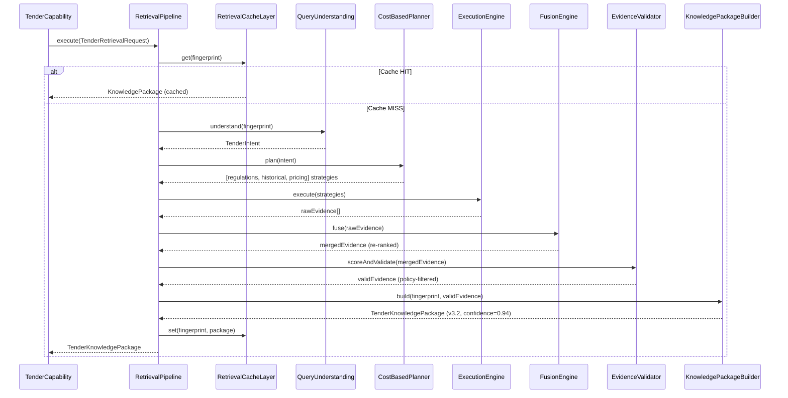
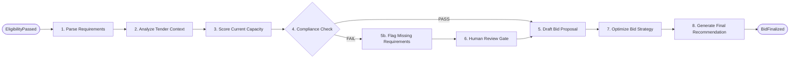
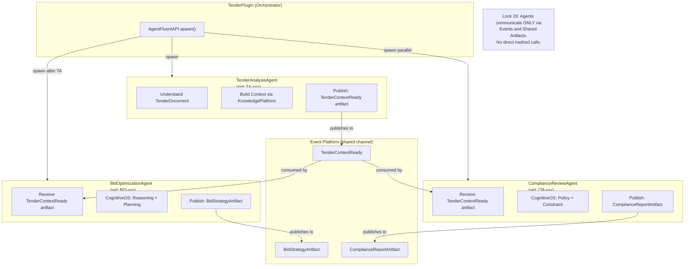

# AI-10B Package B — Intelligence Design
## Tender Plugin — Knowledge, Capability, Workflow & Agent Architecture

> **Package:** B — Intelligence  
> **Sprint:** AI-10B: Tender Plugin Domain Design  
> **Architecture Locks:** Lock 26 (External Adapter Isolation), Lock 27 (Capability Purity), Lock 29 (Agent Independence), Lock 30 (Knowledge Package Versioning), Lock 31 (Decision Reproducibility)

---

## B.1 — Knowledge Mapping

### Knowledge Source Registry

| Source ID | Name | Type | Freshness | Managed By | Lock 30 Versioning |
|---|---|---|---|---|---|
| `tender.knowledge.regulations` | Procurement Regulation DB | Structured | 24h | RuntimeScheduler | ✅ Fingerprint + Version |
| `tender.knowledge.historical-bids` | Historical Bid Archive | Semi-structured | 7d | RuntimeScheduler | ✅ Fingerprint + Version |
| `tender.knowledge.market-pricing` | Market Pricing Intelligence | Structured | 1h | RuntimeScheduler | ✅ Fingerprint + Version |
| `tender.knowledge.technical-specs` | Technical Specification Library | Document | On-demand | Plugin Event | ✅ Fingerprint + Version |
| `tender.knowledge.company-projection` | Company Profile Read Model | Projection (Lock 25) | Event-driven | Event Platform | ✅ Projection Version |

### Knowledge Package Versioning Schema (Lock 30)

```typescript
interface TenderKnowledgePackage {
    packageId: string;
    packageVersion: string;          // "tender-regulations-v3.2"
    knowledgeFingerprint: string;    // SHA256 of evidence set
    evidenceSet: Evidence[];
    freshness: {
        retrievedAt: string;
        expiresAt: string;
        staleness: "FRESH" | "AGING" | "STALE";
    };
    confidence: float;               // 0.0 - 1.0
    sources: string[];               // source IDs used
}
```

### Knowledge Retrieval Flow (per Capability)



---

## B.2 — Capability Matrix

### Capability × Platform Integration Map

| Capability | Purity (Lock 27) | Knowledge Platform | Cognitive OS | Agent Runtime | Event Published |
|---|---|---|---|---|---|
| `tender.document.parse` | ✅ Pure | `TenderDocumentAdapter` → regulations | PolicyEngine | — | `TenderDocumentParsed` |
| `tender.requirement.extract` | ✅ Pure | regulations + specs | RuleEngine | — | `RequirementsExtracted` |
| `tender.eligibility.check` | ✅ Pure | company-projection | PolicyEngine + ConstraintEngine | — | `EligibilityAssessed` |
| `tender.bid.analyze` | ✅ Pure | historical + regulations | ReasoningEngine | — | `BidAnalysisCompleted` |
| `tender.bid.score` | ✅ Pure | — | DecisionEngine | — | `BidScored` |
| `tender.bid.optimize` | ✅ Pure | market-pricing | PlanningEngine | `BidOptimizationAgent` | `BidOptimized` |
| `tender.compliance.review` | ✅ Pure | regulations | PolicyEngine + ConstraintEngine | `ComplianceReviewAgent` | `ComplianceReviewed` |
| `tender.recommendation.generate` | ✅ Pure | all sources | ReasoningEngine + DecisionEngine | `TenderAnalysisAgent` | `RecommendationGenerated` |
| `tender.award.predict` | ✅ Pure | historical | PlanningEngine | — | `AwardPredicted` |
| `tender.workspace.manage` | ✅ Pure | — | — | — | `WorkspaceUpdated` |

> [!IMPORTANT]
> **Lock 27 Enforcement:** Every capability above contains ONLY orchestration logic.  
> All HTTP calls, DB queries, and document parsing are delegated to Adapters.  
> Capabilities receive data already hydrated by Adapters via PluginContext.

### Capability Input/Output Contracts

| Capability | Input | Output | Artifact Produced (Lock 32) |
|---|---|---|---|
| `tender.document.parse` | `TenderDocumentRef` | `ParsedTenderDoc` | `TenderParseArtifact` |
| `tender.eligibility.check` | `TenderId + CompanyProjection` | `EligibilityResult` | `EligibilityReportArtifact` |
| `tender.bid.analyze` | `TenderId + BidDraft` | `BidAnalysisResult` | `BidAnalysisArtifact` |
| `tender.bid.score` | `BidAnalysisResult` | `ScoredBid` | `BidScorecardArtifact` |
| `tender.bid.optimize` | `ScoredBid + MarketData` | `OptimizedBid` | `BidStrategyArtifact` |
| `tender.compliance.review` | `TenderBid + Regulations` | `ComplianceResult` | `ComplianceReportArtifact` |
| `tender.recommendation.generate` | `EvaluationResult` | `Recommendation` | `RecommendationArtifact` |
| `tender.award.predict` | `HistoricalData + CurrentBid` | `AwardPrediction` | `PredictionArtifact` |

---

## B.3 — Workflow Matrix

### Workflow × Capability × Event Chain

| Workflow | Trigger | Steps | Capabilities Used | Events Chain | Deterministic (Lock 28) |
|---|---|---|---|---|---|
| `tender.workflow.discovery` | Manual / Scheduled | 4 | document.parse, requirement.extract | TenderPublished → TenderIndexed → RequirementsExtracted | ✅ |
| `tender.workflow.eligibility` | TenderIndexed | 6 | eligibility.check | EligibilityAssessmentStarted → EligibilityAssessed → Eligible/Failed | ✅ |
| `tender.workflow.bid-preparation` | EligibilityPassed | 8 | bid.analyze, bid.score, compliance.review | BidDraftCreated → BidAnalyzed → BidScored → ComplianceReviewed → BidFinalized | ✅ |
| `tender.workflow.bid-optimization` | BidFinalized | 4 | bid.optimize, recommendation.generate | OptimizationRequested → BidOptimized → RecommendationGenerated | ✅ |
| `tender.workflow.submission` | BidOptimized (human approval) | 3 | workspace.manage | BidSubmitted → SubmissionConfirmed | ✅ |
| `tender.workflow.evaluation` | BidSubmitted | 5 | bid.score, recommendation.generate, award.predict | EvaluationStarted → BidRanked → EvaluationCompleted | ✅ |
| `tender.workflow.award` | EvaluationCompleted | 3 | workspace.manage | AwardDeclared → AwardAccepted | ✅ |

### Workflow DAG: Bid Preparation (Most Complex)



---

## B.4 — Agent Collaboration Architecture (Lock 29)

### Agent Network Design



### Agent Manifest Contracts

| Agent | `agentId` | Knowledge Source | Cognitive Engine | Output Artifact |
|---|---|---|---|---|
| `TenderAnalysisAgent` | `agent.tender.analysis` | regulations + specs | ReasoningEngine | `TenderContextArtifact` |
| `BidOptimizationAgent` | `agent.tender.bid-optimization` | historical + pricing | PlanningEngine + DecisionEngine | `BidStrategyArtifact` |
| `ComplianceReviewAgent` | `agent.tender.compliance` | regulations | PolicyEngine + ConstraintEngine | `ComplianceReportArtifact` |
