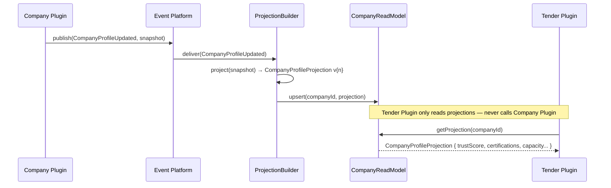
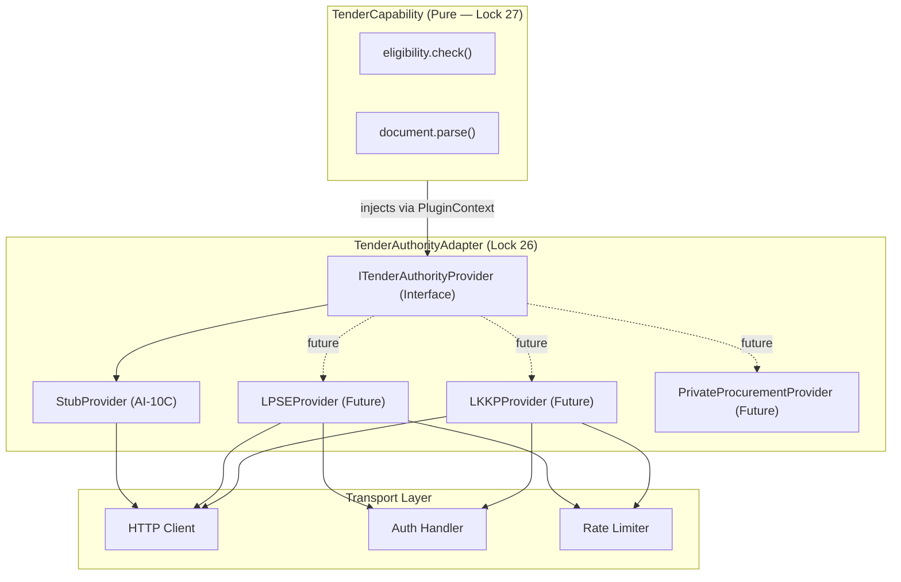

# AI-10B Package C — Integration Design
## Tender Plugin — Event Mapping, API Contract, UI Contract & External Adapter

> **Package:** C — Integration  
> **Sprint:** AI-10B: Tender Plugin Domain Design  
> **Architecture Locks:** Lock 25 (Read Models), Lock 26 (External Adapter Isolation), Lock 33 (Zero Domain Leakage), Lock 34 (Domain Telemetry)

---

## C.1 — Event Mapping

### Domain Event Registry

| Event Type | Publisher | Subscribers | Payload Schema | Platform Mechanism |
|---|---|---|---|---|
| `TenderPublished` | DiscoveryWorkflow | All, Notification | `{ tenderId, title, category, deadline }` | EventBuilder |
| `TenderIndexed` | DiscoveryWorkflow | EligibilityWorkflow | `{ tenderId, knowledgePackageId }` | EventBuilder |
| `RequirementsExtracted` | DiscoveryWorkflow | BidPreparationWorkflow | `{ tenderId, requirementCount }` | EventBuilder |
| `EligibilityAssessmentStarted` | EligibilityWorkflow | TelemetryCollector | `{ tenderId, companyId }` | EventBuilder |
| `EligibilityAssessed` | EligibilityWorkflow | BidPreparationWorkflow | `{ tenderId, companyId, status, score }` | EventBuilder |
| `BidDraftCreated` | BidPreparationWorkflow | ComplianceAgent | `{ tenderId, bidId, draftRef }` | EventBuilder |
| `BidAnalyzed` | BidPreparationWorkflow | BidScoringCapability | `{ bidId, analysisArtifactId }` | EventBuilder |
| `BidScored` | BidPreparationWorkflow | BidOptimizationAgent | `{ bidId, scores, ranking }` | EventBuilder |
| `ComplianceReviewed` | ComplianceAgent | BidPreparationWorkflow | `{ bidId, passed, violations[] }` | EventBuilder |
| `BidFinalized` | BidPreparationWorkflow | SubmissionWorkflow | `{ bidId, status, artifactId }` | EventBuilder |
| `BidOptimized` | BidOptimizationAgent | SubmissionWorkflow | `{ bidId, strategyArtifactId }` | EventBuilder |
| `RecommendationGenerated` | RecommendationCapability | UI + Workspace | `{ tenderId, bidId, recommendation }` | EventBuilder |
| `BidSubmitted` | SubmissionWorkflow | EvaluationWorkflow | `{ tenderId, bidId, submittedAt }` | EventBuilder |
| `SubmissionConfirmed` | TenderAuthorityAdapter | Workspace | `{ tenderId, bidId, confirmationRef }` | EventBuilder |
| `EvaluationCompleted` | EvaluationWorkflow | AwardWorkflow | `{ tenderId, scores, ranking }` | EventBuilder |
| `AwardDeclared` | AwardWorkflow | Company Plugin (via EP) | `{ tenderId, winnerId, awardedValue }` | EventBuilder |
| `KnowledgeRefreshRequested` | TenderPlugin | RuntimeScheduler | `{ sourceId, priority }` | EventBuilder |
| `CompanyProfileUpdated` | **Company Plugin** | **Projection Builder** | `{ companyId, snapshot }` | EventBuilder (consumed) |

### Company Plugin → Read Model Projection Flow (OQ-1 Decision)



---

## C.2 — API Contract

### TenderPlugin Public API (via PluginSDK)

```typescript
// ── Tender Plugin API Contract v1.0 ──────────────────────────────────────────
// Exposed via PluginSDK.registerCapability() — no direct HTTP routes

// ① Tender Discovery
interface TenderDiscoveryAPI {
    discoverTender(ref: TenderDocumentRef): Promise<TenderDiscoveryResult>;
    searchTenders(query: TenderSearchQuery): Promise<TenderDocument[]>;
    getTender(tenderId: string): Promise<TenderDocument | null>;
}

// ② Eligibility Assessment
interface TenderEligibilityAPI {
    assessEligibility(tenderId: string, companyId: string): Promise<EligibilityResult>;
    getEligibilityReport(tenderId: string, companyId: string): Promise<TenderArtifact>;
}

// ③ Bid Management
interface TenderBidAPI {
    createBidDraft(tenderId: string, companyId: string): Promise<TenderBid>;
    analyzeBid(bidId: string): Promise<BidAnalysisResult>;
    scoreBid(bidId: string): Promise<ScoredBid>;
    optimizeBid(bidId: string): Promise<OptimizedBid>;
    submitBid(bidId: string): Promise<SubmissionResult>;
    getBid(bidId: string): Promise<TenderBid | null>;
}

// ④ Compliance
interface TenderComplianceAPI {
    reviewCompliance(bidId: string): Promise<ComplianceResult>;
    getComplianceReport(bidId: string): Promise<TenderArtifact>;
}

// ⑤ Evaluation & Recommendation
interface TenderIntelligenceAPI {
    generateRecommendation(tenderId: string, bidId: string): Promise<Recommendation>;
    predictAward(tenderId: string): Promise<AwardPrediction>;
    getRecommendationArtifact(tenderId: string): Promise<TenderArtifact>;
}

// ⑥ Workspace
interface TenderWorkspaceAPI {
    createWorkspace(tenderId: string, companyId: string): Promise<TenderWorkspace>;
    getWorkspace(tenderId: string): Promise<TenderWorkspace | null>;
    updateWorkspace(workspaceId: string, data: Partial<TenderWorkspace>): Promise<void>;
}

// ── Value Objects ─────────────────────────────────────────────────────────────
interface TenderDocumentRef { url?: string; fileRef?: string; rawContent?: string; }
interface TenderSearchQuery { keyword?: string; category?: string; region?: string; deadline?: DateRange; }
interface EligibilityResult { status: "ELIGIBLE" | "INELIGIBLE" | "PENDING"; score: float; passedCriteria: string[]; failedCriteria: string[]; artifactId: string; }
interface SubmissionResult { success: boolean; confirmationRef: string; submittedAt: string; }
interface Recommendation { strategyId: string; confidence: float; reasoningPath: string[]; evidence: string[]; artifactId: string; }
interface AwardPrediction { probability: float; confidence: float; reasoning: string; artifactId: string; }

// ── Decision Reproducibility Record (Lock 31) ─────────────────────────────────
interface ReasoningRecord {
    evidenceIds: string[];
    appliedRules: string[];
    appliedPolicies: string[];
    constraintResults: Array<{ id: string; severity: string }>;
    reasoningPath: string[];
    confidence: float;
    generatedAt: string;
    knowledgePackageVersion: string;    // Lock 30 integration
}
```

---

## C.3 — UI Contract

```typescript
// ── Tender Plugin UI Contract v1.0 ───────────────────────────────────────────
// Exposed via PluginSDK.registerCapability() → UI discovery via manifest.json

export const TenderUIContract = {
    navigation: {
        label: "Tender Intelligence",
        path: "/workspace/tender",
        icon: "tender-icon",
        badgeProvider: "TenderBadgeProvider"   // active tender count
    },

    pages: {
        "TenderDashboard":     "/workspace/tender",
        "TenderDetail":        "/workspace/tender/:tenderId",
        "BidWorkspace":        "/workspace/tender/:tenderId/bid",
        "EligibilityReport":   "/workspace/tender/:tenderId/eligibility",
        "ComplianceReport":    "/workspace/tender/:tenderId/compliance",
        "BidStrategy":         "/workspace/tender/:tenderId/strategy",
        "AwardPrediction":     "/workspace/tender/:tenderId/prediction",
        "TenderHistory":       "/workspace/tender/history"
    },

    widgets: [
        "ActiveTendersWidget",        // list of current tenders
        "BidStatusWidget",            // bid pipeline status
        "EligibilityScoreWidget",     // eligibility at a glance
        "AwardPredictionWidget",      // ML prediction badge
        "ComplianceStatusWidget",     // pass/fail indicator
        "TenderTimelineWidget"        // milestone countdown
    ],

    commandPalette: [
        "Search Tenders",
        "Assess Eligibility",
        "Create Bid Draft",
        "Optimize Bid Strategy",
        "Review Compliance",
        "Generate Recommendation",
        "Predict Award Outcome"
    ],

    quickActions: [
        "Start New Tender Analysis",
        "Submit Pending Bid",
        "Export Bid Strategy"
    ],

    searchProvider: "TenderSearchProvider",
    settingsProvider: "TenderSettingsProvider",

    artifactViewers: {
        "EligibilityReportArtifact":  "EligibilityReportViewer",
        "BidAnalysisArtifact":        "BidAnalysisViewer",
        "BidStrategyArtifact":        "BidStrategyViewer",
        "ComplianceReportArtifact":   "ComplianceReportViewer",
        "RecommendationArtifact":     "RecommendationViewer",
        "PredictionArtifact":         "PredictionViewer"
    }
} as const;
```

---

## C.4 — External Adapter Architecture (Lock 26 — OQ-2 Decision)

### Provider Interface Hierarchy



### ITenderAuthorityProvider Interface

```typescript
// ── Lock 26: External Adapter Isolation Contract ──────────────────────────────
export interface ITenderAuthorityProvider {
    fetchTenderDocument(ref: TenderDocumentRef): Promise<RawTenderDocument>;
    submitBid(bidPackage: BidPackage): Promise<SubmissionReceipt>;
    fetchSubmissionStatus(bidId: string): Promise<SubmissionStatus>;
    fetchAwardResults(tenderId: string): Promise<AwardResult[]>;
}

// Stub implementation (AI-10C)
export class TenderAuthorityStubProvider implements ITenderAuthorityProvider {
    async fetchTenderDocument(ref: TenderDocumentRef): Promise<RawTenderDocument> {
        return { content: "STUB: Tender Document Content", format: "PDF", pages: 42 };
    }
    async submitBid(bidPackage: BidPackage): Promise<SubmissionReceipt> {
        return { success: true, confirmationRef: `STUB-${Date.now()}`, submittedAt: new Date().toISOString() };
    }
    async fetchSubmissionStatus(bidId: string): Promise<SubmissionStatus> {
        return { bidId, status: "RECEIVED", receivedAt: new Date().toISOString() };
    }
    async fetchAwardResults(tenderId: string): Promise<AwardResult[]> {
        return [{ tenderId, winnerId: "STUB-COMPANY", awardedValue: 0, declaredAt: new Date().toISOString() }];
    }
}
```

---

## C.5 — Domain Telemetry Contract (Lock 34)

```typescript
// ── Domain Telemetry (Lock 34) — Separated from Platform Telemetry ────────────
export interface TenderDomainTelemetry {
    // Business Metrics
    bidWinRate: number;          // winning bids / total submitted bids
    eligibilityAccuracy: number; // correct eligibility decisions / total
    submissionSuccessRate: number; // successful submissions / total attempts
    compliancePassRate: number;  // first-pass compliance / total
    predictionAccuracy: number;  // correct award predictions / total declared

    // Volume Metrics
    activeTenders: number;
    totalBidsSubmitted: number;
    totalBidsWon: number;
    pendingEligibilityChecks: number;
    openWorkspaces: number;

    // AI Performance
    averageReasoningConfidence: number;
    knowledgePackageFreshness: "FRESH" | "AGING" | "STALE";
    averageBidCycleTimeHours: number;
}
```
