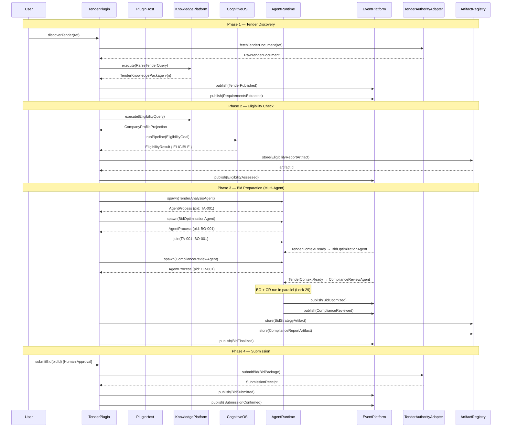
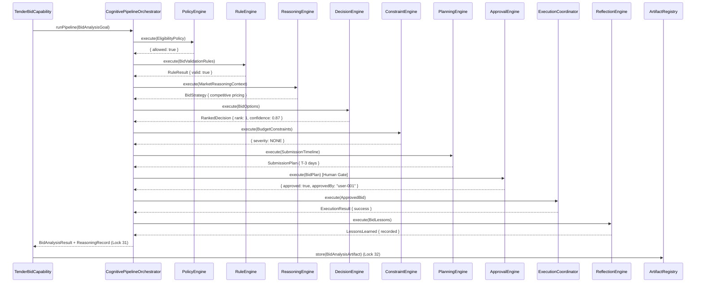
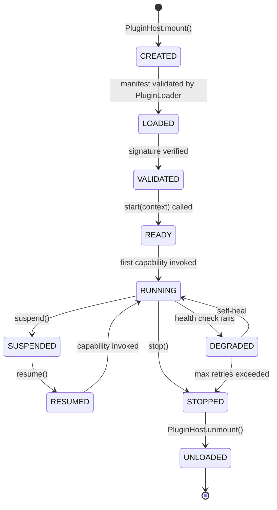
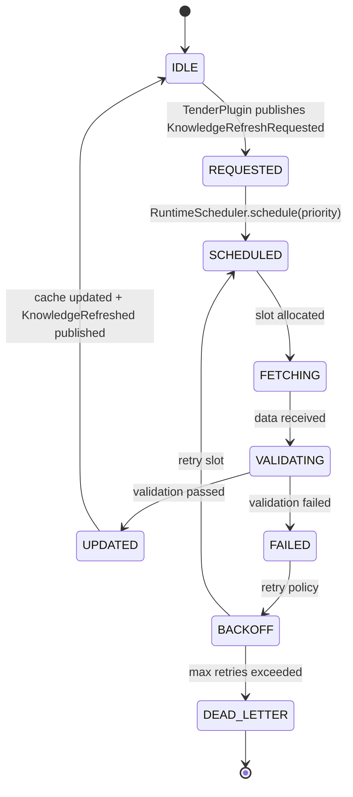
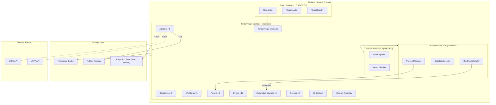
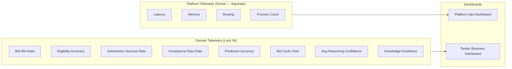
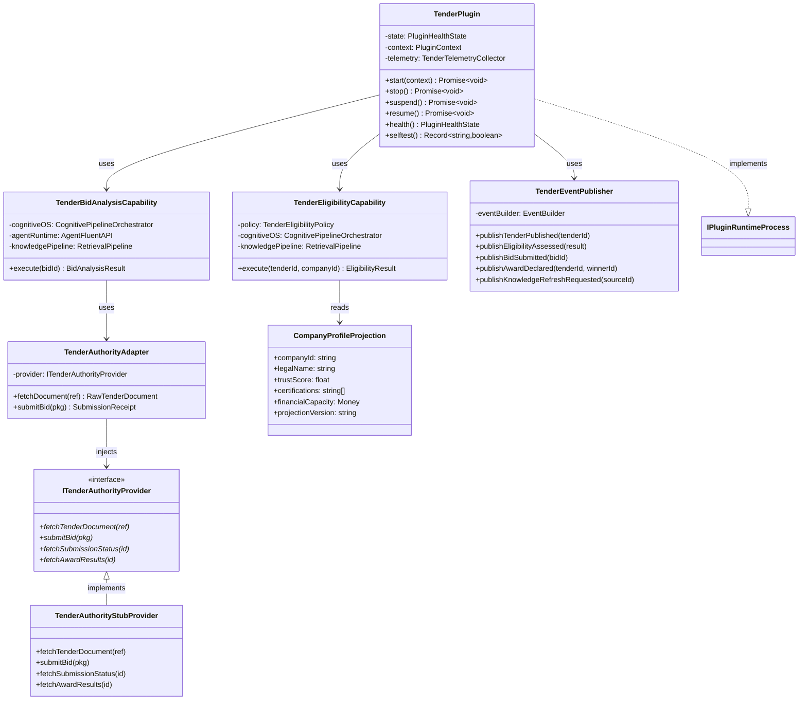

# AI-10B Package D — Runtime Design
## Tender Plugin — Sequence, State, Deployment & Telemetry Diagrams

> **Package:** D — Runtime  
> **Sprint:** AI-10B: Tender Plugin Domain Design  
> **Architecture Locks:** Lock 28 (Workflow Determinism), Lock 29 (Agent Independence), Lock 30 (Knowledge Package Versioning), Lock 31 (Decision Reproducibility)

---

## D.1 — Sequence Diagram: Full Tender Lifecycle

---

## D.2 — Sequence Diagram: Cognitive Pipeline Execution (Bid Analysis)

---

## D.3 — State Diagram: TenderPlugin Lifecycle

---

## D.4 — State Diagram: Knowledge Refresh (RuntimeScheduler — OQ-3)

---

## D.5 — Deployment Diagram

---

## D.6 — Domain Telemetry Diagram (Lock 34)

---

## D.7 — Class Diagram: Core Plugin Structure

