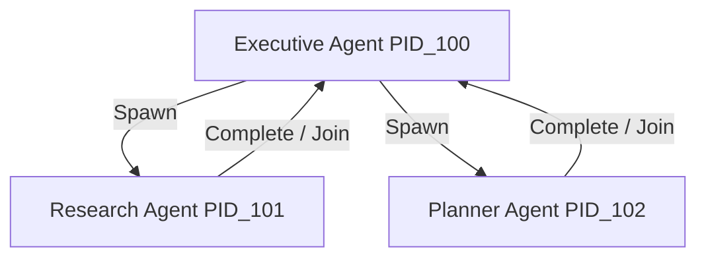
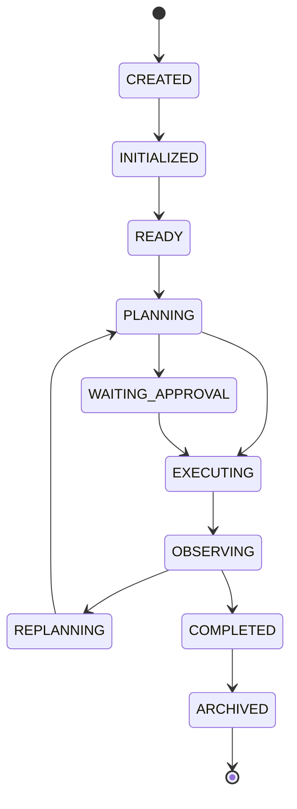
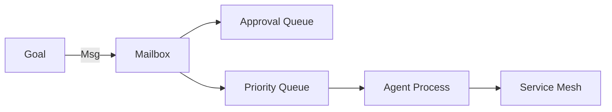
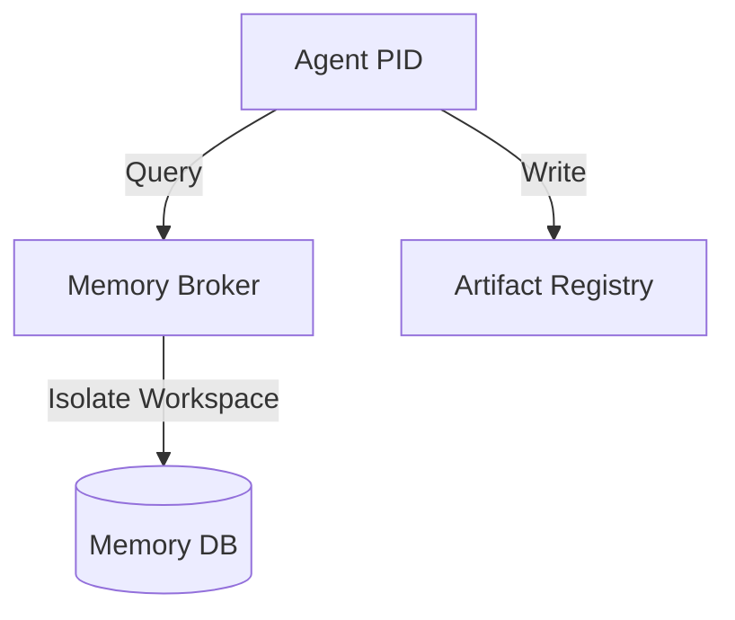
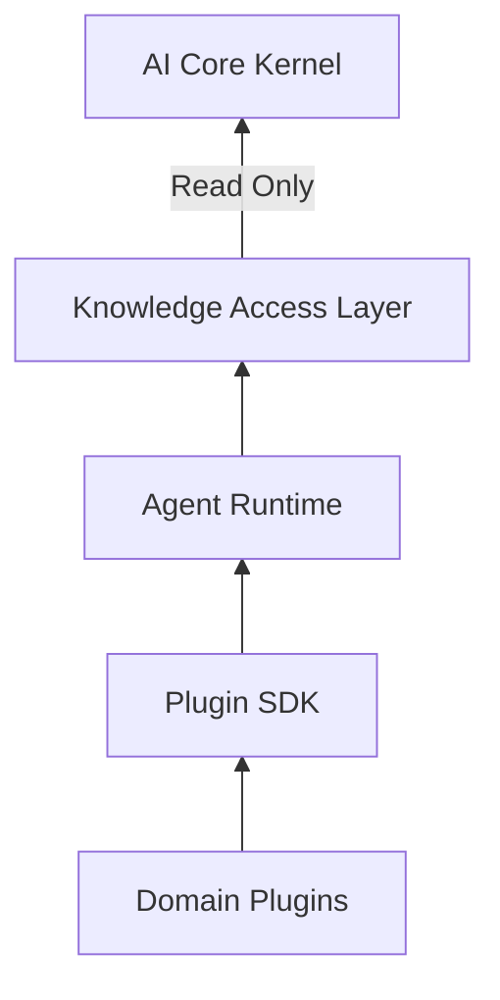

# DIAGRAMS-02: Agent Runtime Enterprise Models

## 1. PROCESS MODEL (Parent-Child Agents)

## 2. STATE MODEL (Agent Lifecycle)

## 3. RUNTIME MODEL (Scheduler & Mailbox)

## 4. SECURITY MODEL (Memory Broker & Workspace)

## 5. DEPLOYMENT MODEL (Era-2 Freeze Architecture)

