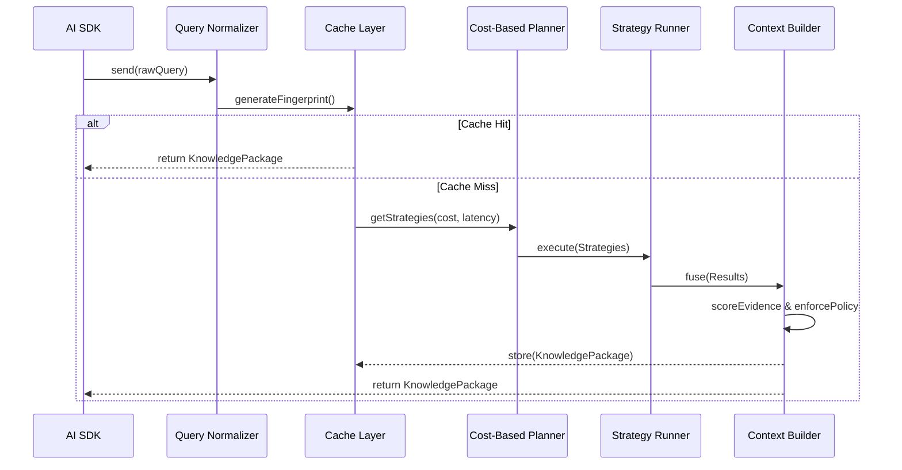
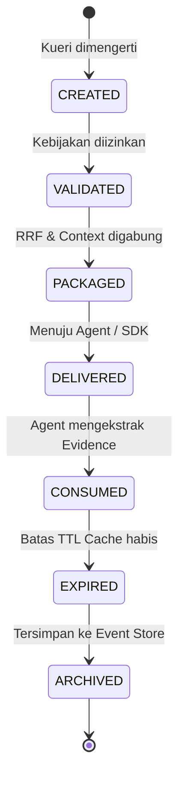

# DIAGRAMS: AI-06 Architecture Visualizations

## 1. Component Diagram
```mermaid
graph TD
    A[Plugin SDK / Client] -->|Search Request| B[AI.retrieve Fluent API]
    B --> C[Query Normalizer & Fingerprint]
    C --> D[Retrieval Cache Layer]
    D -.->|Cache Miss| E[Query Understanding & Expansion]
    E --> F[Cost-Based Planner]
    F --> G[Strategy Runner (Vector/Graph/SQL)]
    G --> H[Fusion & RRF Engine]
    H --> I[Evidence Scoring]
    I --> J[Retrieval Context Builder]
    J --> K[Immutable Knowledge Package]
    K -.->|Cache Store| D
```

## 2. Sequence Diagram (Pipeline Execution)


## 3. State Diagram (Knowledge Package Lifecycle)

