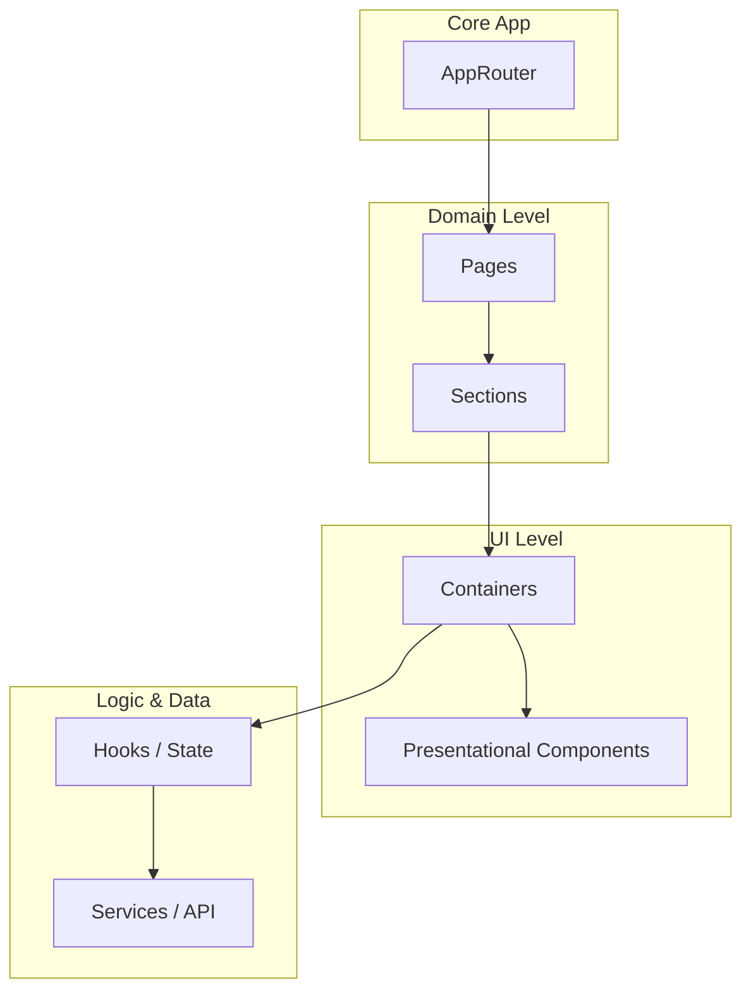
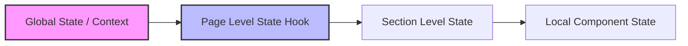
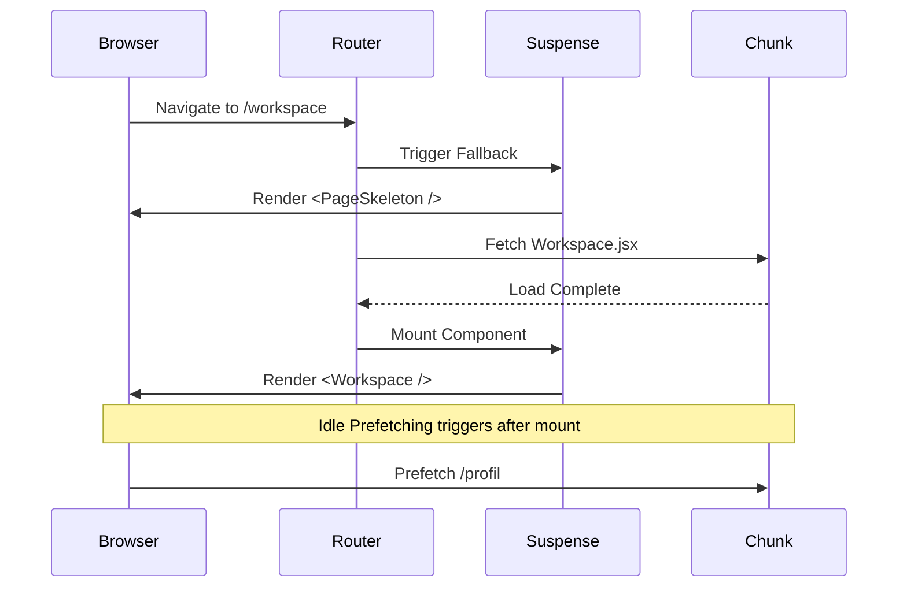

# Architecture Overview - TeamTender

This document describes the high-level architecture for the TeamTender Frontend application, focusing on the changes made during Wave 3 (Modernization) to prepare for backend integration (Wave 4).

## 1. Layered Architecture

TeamTender adopts a strictly layered architecture to decouple UI from business logic and routing.

- **AppRouter**: Handles top-level routing, Suspense, and the root Error Boundary.
- **Pages**: Entry points for major domains (e.g., `Workspace.jsx`, `TenderBaru.jsx`). Responsibilities include fetching initial data and managing sub-routing.
- **Sections**: Logical groupings within a page (e.g., `PersonilSection`, `AhspSection`).
- **Containers/Components**: Dumb components focusing purely on UI representation.
- **Hooks**: Custom hooks (e.g., `useWorkspace`) that manage state and actions.

## 2. State Ownership

State is managed contextually based on the scope of its usage.

- **Global State**: Environment configs (`ENV`, `FEATURES`), Authentication state, and selected Role.
- **Page Level State**: Managed by custom hooks like `useWorkspace` or `useTenderBaru`. It acts as the single source of truth for the entire page's workflow.
- **Local State**: Managed inside dumb components for transient UI state (e.g., `isModalOpen`, `searchQuery`).

## 3. Lazy Loading & Suspense Flow

To meet performance budgets, TeamTender uses Route-level and Component-level code splitting.

- **Route Level**: All major pages are wrapped in `React.lazy()` and `RouteErrorBoundary`.
- **Component Level**: Heavy UI sections (like `AhspSection` and `BoqSection`) are lazy-loaded within the `Workspace` to ensure fast initial time-to-interactive.
- **Error Boundaries**: Layered at the App, Route, and Section levels to prevent catastrophic crashes and provide localized recovery options (e.g., "Reload Section").
