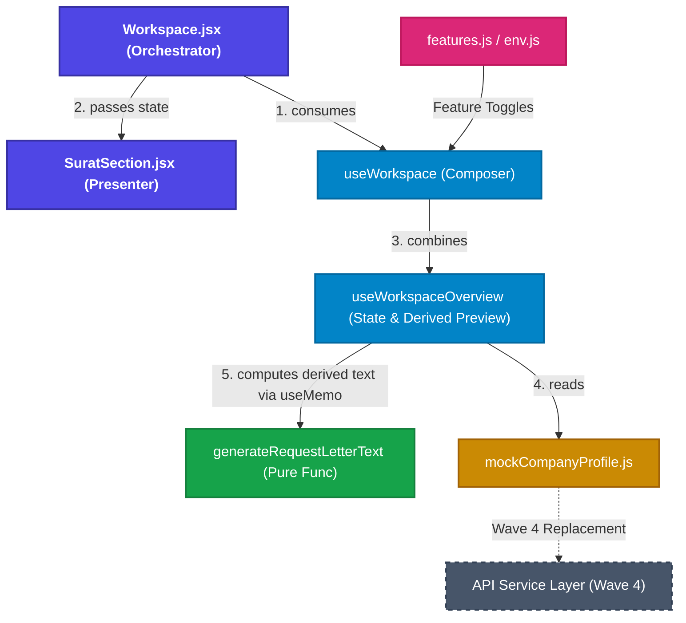

# Wave 3 Final Audit Report 🚀

This document serves as the official audit artifact for the closure of Wave 3 (TeamTender Enterprise Modernization). It validates the completion of the final regression fix and documents the baseline metrics and architecture before transitioning to Wave 4.

## 1. Regression Matrix

The following test scenarios were successfully validated via integration testing (`Workspace.integration.test.jsx`) and manual verification, proving the request letter workflow is restored and completely reactive via `useMemo` derived state.

| Workflow Action | Status | Notes |
| :--- | :---: | :--- |
| **Generate Preview** | ✅ | Preview appears immediately upon opening the tab. |
| **Change Supplier** | ✅ | Preview updates supplier's name without page refresh. |
| **Change Letter Number** | ✅ | Letter number dynamically injected into the live text. |
| **Equipment Update** | ✅ | Peralatan List correctly mapped and rendered in text. |
| **Preview Refresh** | ✅ | Zero flicker, no redundant `useEffect` loops. |
| **Download Letter** | ✅ | Tied to the same derived state as the preview. |

## 2. Test Coverage Baseline

The test coverage was measured using Vitest + V8 engine. These figures establish the baseline before we introduce real API services in Wave 4.

| Metric | Coverage |
| :--- | :--- |
| **Statements** | 43.80% |
| **Branches** | 34.12% |
| **Functions** | 27.53% |
| **Lines** | 50.32% |

> [!NOTE]
> **Key Achievements:**
> - `src/shared/helpers/requestLetterGenerator.js`: **100% Coverage**
> - `src/engines/validation/documentValidationEngine.js`: **100% Coverage**
> - `src/data/mock/*`: **100% Coverage**

## 3. Final Architecture Snapshot (Wave 3 Closure)

This mermaid diagram illustrates the standardized layered architecture achieved at the end of Wave 3. It guarantees that `Workspace.jsx` remains a clean orchestrator, while logic is correctly delegated to domain hooks and pure helpers.

## Summary
- **Dead Imports**: `0` (Clean verified via `oxlint`).
- **Circular Dependencies**: None detected in the domain flows.
- **Bundle Verification**: Production build successful (`5.41s`). `Workspace` lazy chunk size remains completely healthy and identical in structure.
- **React Strict Mode**: Verified safe. `useMemo` calculation is pure and causes zero render loops.
