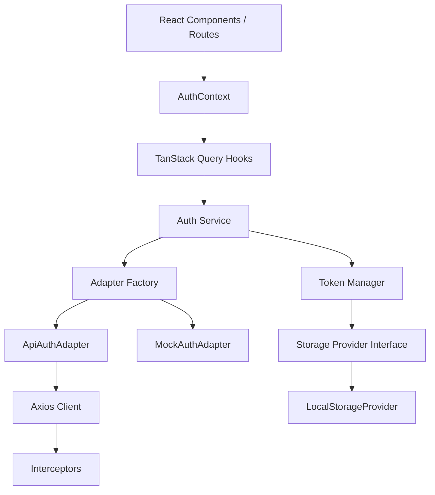
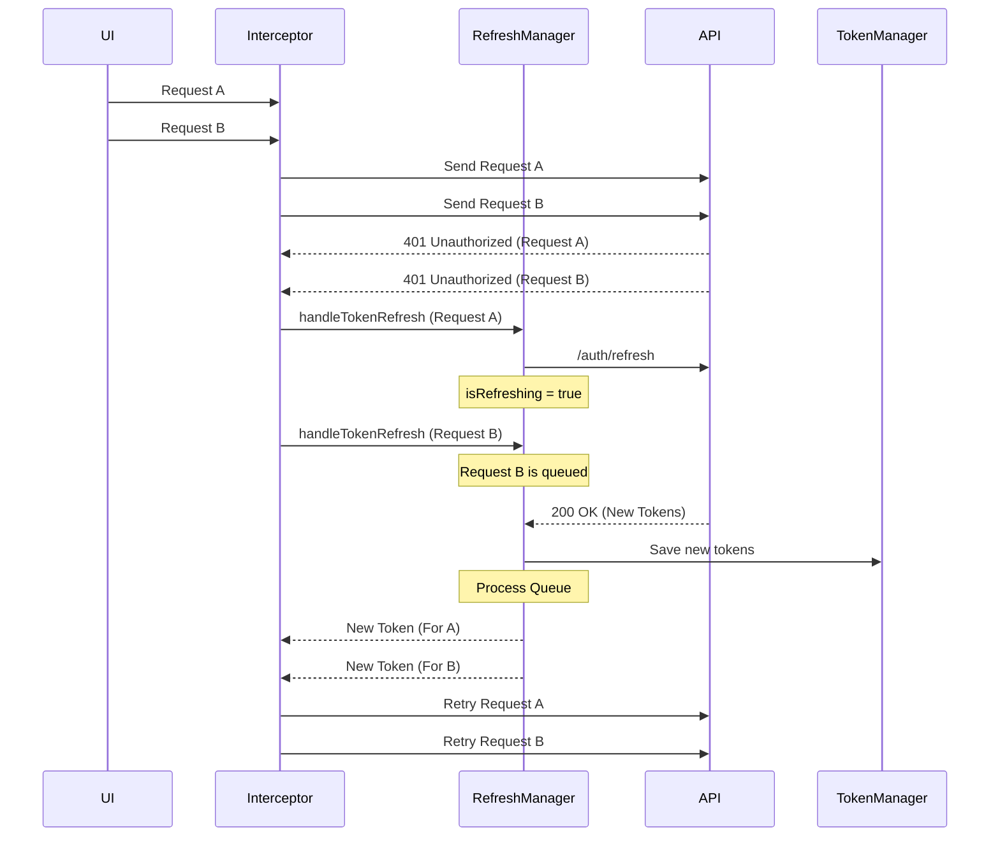
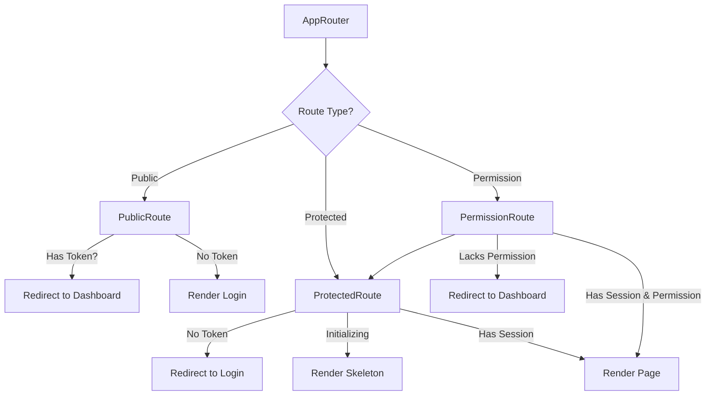

# Wave 4.2: Authentication & Session Management

This document outlines the architecture and workflows for the authentication subsystem in TeamTender React.

## 1. Architecture Overview

The authentication subsystem is designed to be storage-agnostic, easily mockable, and integrated closely with React Query and Axios interceptors.

## 2. Storage Abstraction

Tokens are **not** directly written to `localStorage` from the services. Instead, we use a `TokenStorageProvider` interface.

- **Current Implementation**: `LocalStorageProvider`
- **Future Ready**: Can be swapped for `CookieProvider` or `SessionStorageProvider` by simply changing the instantiation in `tokenStorage.js` without modifying business logic.

## 3. Login Flow

1. User submits credentials in `/login`.
2. `useLoginMutation` calls `authService.login`.
3. `authService.login` delegates to the configured adapter (`MockAuthAdapter` or `ApiAuthAdapter`).
4. On success, `tokenManager` saves the Access Token and Refresh Token.
5. The `currentUser` data is seeded into the React Query cache `['auth', 'currentUser']`.
6. User is redirected to `/dashboard` (or the `from` route).

## 4. Session Recovery & Refresh Flow

This is one of the most critical parts of the subsystem. It must handle concurrent 401s elegantly without causing duplicate refresh requests.

## 5. Protected Routing Stack

Routes are protected in the following order:

1. **Token Check**: Fast synchronous check (`tokenManager.isAuthenticated()`)
2. **Session Verification**: Asynchronous fetch of `/me` via `useCurrentUserQuery`
3. **Permission Check**: RBAC evaluation via `PermissionRoute` (if applicable)
4. **Render**: The actual page component renders.

## 6. Multi-tab Logout Synchronization

If a user logs out in Tab A, Tab B must also log out automatically to prevent ghost sessions.

- When `authService.logout()` is called, it triggers a custom `window.dispatchEvent(new Event('auth:logout'))`.
- `AuthContext` listens for this event to clear the query cache and redirect to `/login`.
- `AuthContext` also listens for the native `storage` event. If the `tt_access_token` is cleared in another tab, it triggers the same local logout flow.
