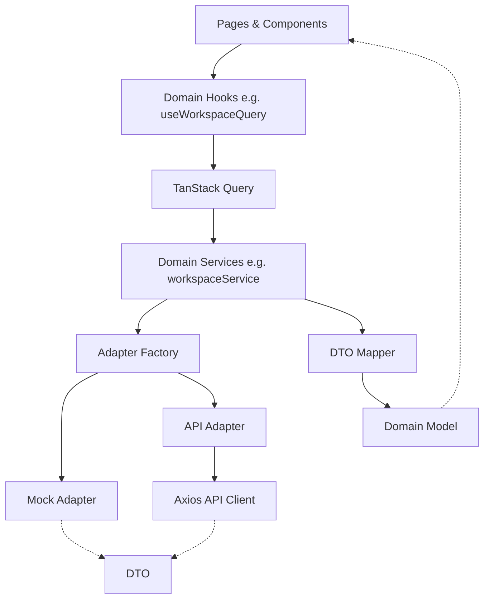

# Wave 4.1: Service Layer & API Foundation

## Arsitektur

TeamTender telah mengimplementasikan Service Layer terpusat sebagai satu-satunya pintu komunikasi antara Frontend dan Backend. Arsitektur ini dirancang untuk memastikan reusability, testability, dan kemudahan saat masa transisi API atau Mock data.

## Komponen Kunci

### 1. API Client (`src/services/client`)
- **`apiClient.js`**: Instance axios terpusat dengan base URL dan timeout.
- **`AppErrors.js`**: Standardisasi error yang diterima UI (`AppError`, `NetworkError`, `UnauthorizedError`, dll). UI akan selalu menerima error dalam format ini: `{ code, message, status, details, retryable }`.
- **`errorMapper.js`**: Interceptor yang memetakan response error dari Axios ke instance `AppError`.
- **`interceptors.js`**: Setup middleware untuk Auth Headers dan Retry Policy.

### 2. Domain Service (Contoh: Workspace Pilot) (`src/services/workspace`)
- **`workspace.dto.js`**: Representasi tipe struktur data persis seperti response backend (DTO - Data Transfer Object).
- **`workspace.types.js`**: Representasi model domain yang dipakai murni oleh Frontend UI.
- **`workspaceMapper.js`**: Pure function yang bertugas memetakan DTO menjadi Domain Model. Tidak boleh ada mutasi, panggilan API, atau akses state.
- **`AdapterFactory.js`**: Factory yang memutuskan apakan service menggunakan `MockWorkspaceAdapter` atau `ApiWorkspaceAdapter` bergantung pada `FEATURES.useMockApi` dari konfigurasi `env.js`.

### 3. State Management
- TanStack Query diinisialisasi di `src/config/query.js`.
- Semua query keys terpusat di `src/hooks/queries/queryKeys.js` untuk mencegah bentrok dan memudahkan invalidasi cache.

## Keuntungan
1. **Separation of Concerns**: UI tidak lagi tahu menahu soal `axios`, `fetch`, atau struktur JSON backend.
2. **Resilience**: Error Boundary dan mapper memastikan setiap request gagal akan disajikan ke pengguna dalam pesan yang dimengerti (bukan `[object Object]`).
3. **Developer Experience**: Dengan adanya Mock Adapter, pengembangan frontend dapat terus berlanjut tanpa menunggu endpoint backend siap 100%. Switch cukup dilakukan di `features.js`.
4. **Consistency**: Penggunaan mapper murni memaksa konsistensi properti model, mengurangi bug `undefined` property di UI.
