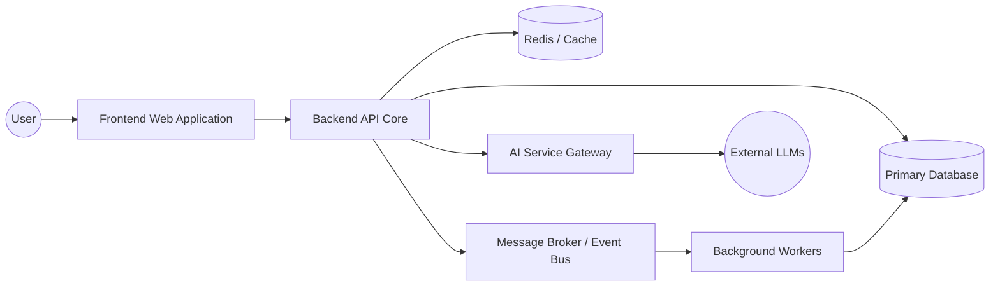

# Application Architecture

The Application Architecture defines how TeamTender is modularized at the software level.

## Application Modules

TeamTender is designed as a modular system, separating concerns between user interfaces, core APIs, asynchronous processing, and specialized services.

- **Frontend Application (Web)**: The primary user interface (React/Next.js). Interacts exclusively with the API Gateway.
- **Backend API (Core)**: The central application serving business logic, managing transactions, and interacting with the database.
- **Background Workers**: Processes handling asynchronous tasks (e.g., email sending, data aggregation).
- **AI Service Gateway**: A dedicated module (internal or externalized) handling interactions with Large Language Models.

## Module Relationships

## Integration Principles
- **API First**: All frontend interactions must occur through well-defined APIs.
- **Asynchronous by Default**: Long-running operations must be offloaded to background workers.
- **Stateless API**: The Backend API should remain stateless to allow horizontal scaling.

*For specific technology choices, see the [Technology Architecture](./Technology-Architecture.md).*
