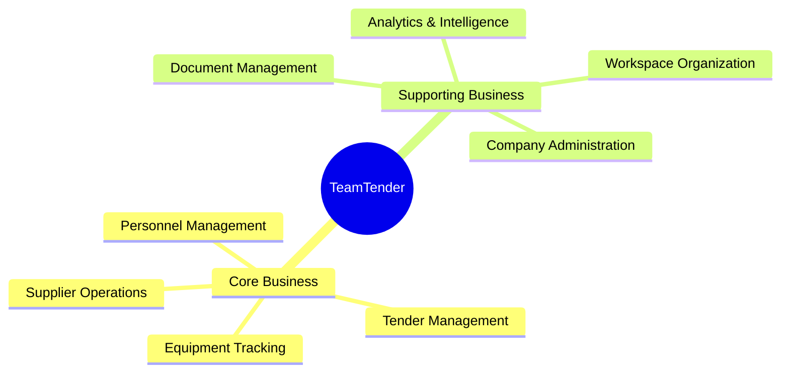

# Business Architecture

## Business Vision
To provide a comprehensive, intelligent, and scalable platform that revolutionizes how organizations manage tenders, teams, and operations, leveraging cutting-edge AI and data analytics to optimize decision-making and operational efficiency.

## Business Capabilities Map

## Core Business
The Core Business defines the primary value streams of TeamTender.

| Area | Description | Strategic Goal |
|---|---|---|
| **Tender Management** | End-to-end lifecycle management of tenders, bids, and contracts. | Maximize win rates and streamline the bidding process. |
| **Supplier Operations** | Vendor qualification, onboarding, and performance tracking. | Ensure a robust and reliable supply chain. |
| **Equipment Tracking** | Managing assets, maintenance, and allocation. | Optimize asset utilization and minimize downtime. |
| **Personnel Management** | Managing employee profiles, roles, and assignments. | Efficiently allocate human resources to projects/tenders. |

## Supporting Business
The Supporting Business provides the necessary foundation for the Core Business to function effectively.

| Area | Description | Strategic Goal |
|---|---|---|
| **Analytics & Intelligence** | Data insights, reporting, and AI-driven recommendations. | Enable data-driven decision making across all domains. |
| **Document Management** | Centralized storage, versioning, and retrieval of documents. | Ensure compliance, security, and easy access to critical files. |
| **Workspace/Company** | Multi-tenant organization grouping and isolation. | Provide secure, scalable environments for distinct organizational entities. |

*See [Capability Architecture](./Capability-Architecture.md) for detailed capability breakdowns.*
