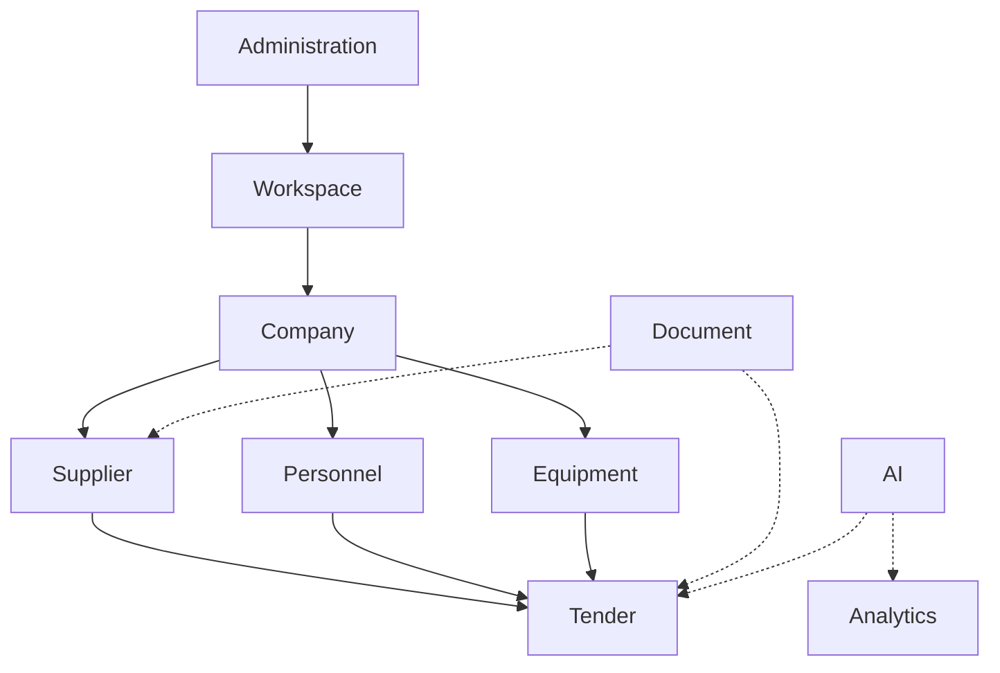

# Capability Architecture

This document breaks down the major capabilities of the TeamTender platform, defining their operational boundaries.

| Capability | Purpose | Inputs | Outputs | Dependencies |
|---|---|---|---|---|
| **Workspace** | Manages logical groupings (tenants) to isolate resources and users. | Tenant details, User associations | Workspace configurations, Isolation policies | Administration, Company |
| **Company** | Manages organizational entities, their profiles, and structures. | Company data, Hierarchy details | Company profiles, Org charts | Workspace |
| **Personnel** | Manages employee records, skills, and project allocations. | User data, Roles, Skillsets | Personnel profiles, Availability matrices | Company, Administration |
| **Equipment** | Tracks physical assets, maintenance schedules, and locations. | Asset details, Telemetry (future) | Asset status, Maintenance alerts | Company, Supplier |
| **Supplier** | Manages vendor relationships, qualifications, and ratings. | Vendor data, Performance metrics | Approved vendor lists, Risk assessments | Document, Company |
| **Tender** | Orchestrates the end-to-end bidding and tender process. | Bid details, Requirements, Deadlines | Tender submissions, Status tracking | Document, Supplier, Personnel |
| **Document** | Centralized file storage, versioning, and access control. | Files, Metadata, Access policies | Stored documents, Download links | (Foundation Capability) |
| **AI** | Provides intelligent insights, summarization, and automation. | Prompts, Context data (from domains) | AI responses, Generated content | Document, Analytics (and all domains) |
| **Analytics** | Aggregates data to provide operational dashboards and reporting. | Event data, Domain data | Reports, Dashboards, KPIs | Data Architecture |
| **Administration** | System-level settings, RBAC, and platform configuration. | Roles, Policies, System parameters | Access tokens, Enforced policies | (Foundation Capability) |

## Capability Relationships

*These capabilities map directly to our [Domain Architecture](./Domain-Architecture.md).*
