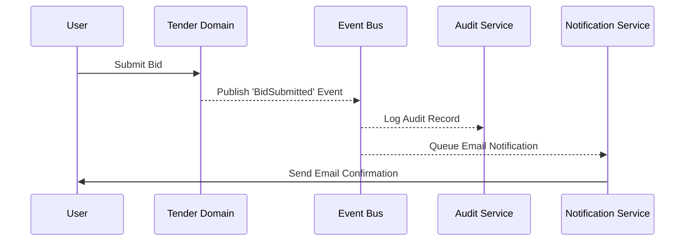

# Cross-Cutting Architecture

Cross-Cutting Architecture defines the concerns that affect the entire application, spanning across all [Domains](./Domain-Architecture.md) and layers.

## Core Concerns

| Concern | Description | Implementation Strategy |
|---|---|---|
| **Authentication** | Verifying user identity. | Centralized Identity Provider (IdP), JWT tokens. |
| **Authorization** | Verifying user permissions. | Role-Based Access Control (RBAC) enforced at the API Gateway and Domain boundaries. |
| **Configuration** | Managing environment variables. | Centralized configuration management, injected at runtime. |
| **Logging** | Recording application events. | Structured JSON logging, centralized aggregation. |
| **Metrics** | Tracking system health. | Time-series metrics collection (e.g., Prometheus) tracking throughput, latency, and error rates. |
| **Distributed Tracing** | Tracing requests across services. | Injection of trace IDs at the Gateway, propagating through all services via OpenTelemetry. |
| **Health Checks** | Monitoring service availability. | Liveness and readiness endpoints for orchestrator (Kubernetes) routing. |
| **Audit** | Tracking critical business changes. | Dedicated immutable audit trail tables tracking `Who`, `What`, `When`, and `Why`. |
| **Notification** | Alerting users. | Centralized Notification Service listening to the Event Bus. |
| **Event Bus** | Asynchronous communication. | Message broker enabling decoupled domain communication. |

## Observability Principles
- **Traceability**: Every request entering the system must be assigned a unique Trace ID that is included in every log, metric, and downstream request.
- **Actionable Alerts**: Metrics and logs should trigger alerts only when they require human intervention.
- **Proactive Monitoring**: Dashboards should reflect Service Level Objectives (SLOs) and business KPIs, not just CPU/Memory usage.

## Cross-Cutting Flow Example (Audit & Notification)

