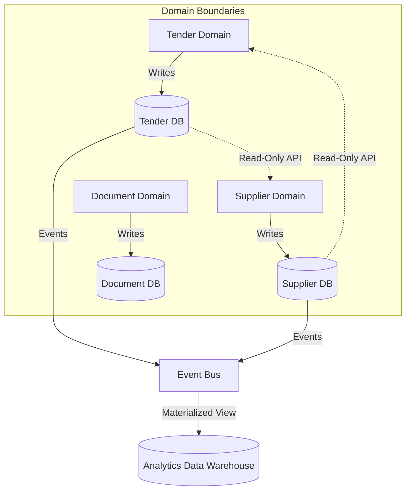

# Data Architecture

The Data Architecture outlines how data is stored, owned, and communicated across the TeamTender platform.

## Principles

1. **Single Source of Truth**: Each piece of core business data has one definitive source (specific domain database/schema).
2. **Data Ownership**: Domains own their data. Direct database access from outside a domain's boundary is strictly prohibited.
3. **Eventual Consistency**: Cross-domain updates should prefer asynchronous eventual consistency over distributed transactions.

## Data Flow & Ownership

## Persistence Principles

- **Relational by Default**: Use normalized relational databases (e.g., PostgreSQL via Prisma) for core domain entities ensuring ACID compliance.
- **Blob Storage for Files**: Use dedicated object storage (e.g., S3-compatible) for Documents, keeping databases lean.
- **Caching**: Use in-memory data stores (e.g., Redis) for frequently accessed, read-heavy data.
- **Cross-Domain Communication**: Domains must communicate via API calls (synchronous) or Domain Events (asynchronous via the [Event Bus](./Cross-Cutting-Architecture.md)).
