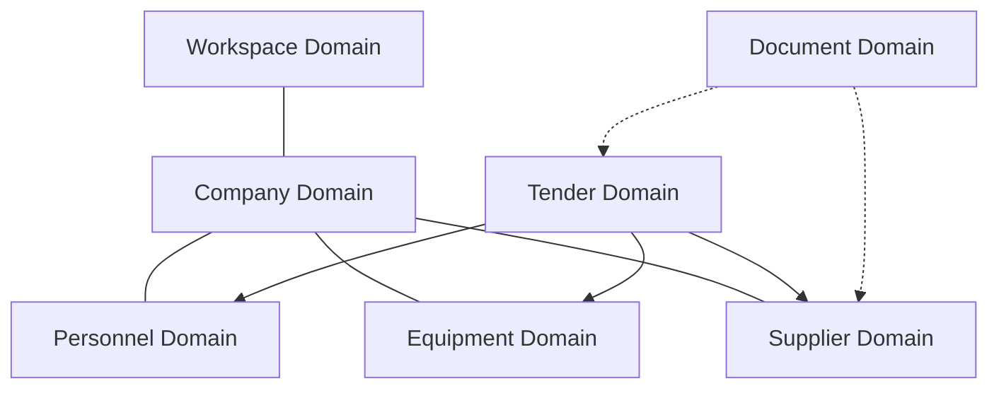

# Domain Architecture

TeamTender follows Domain-Driven Design (DDD) principles. This architecture breaks the system down into bounded contexts.

## Domain Context Map

## Detailed Domains

### 1. Workspace Domain
- **Purpose**: Multi-tenant isolation.
- **Aggregate Root**: `Workspace`
- **Entities**: `WorkspaceSetting`, `WorkspaceMember`
- **Services**: `WorkspaceProvisioningService`
- **Repositories**: `WorkspaceRepository`
- **Events**: `WorkspaceCreated`, `WorkspaceDeleted`
- **Future Expansion**: Cross-workspace collaboration policies.

### 2. Company Domain
- **Purpose**: Organizational management.
- **Aggregate Root**: `Company`
- **Entities**: `Department`, `Location`
- **Services**: `CompanyHierarchyService`
- **Repositories**: `CompanyRepository`
- **Events**: `CompanyRegistered`
- **Future Expansion**: Subsidiary management.

### 3. Personnel Domain
- **Purpose**: Human resource allocation.
- **Aggregate Root**: `Employee`
- **Entities**: `Role`, `Skill`, `Certification`
- **Services**: `EmployeeAllocationService`
- **Repositories**: `EmployeeRepository`
- **Events**: `EmployeeOnboarded`, `CertificationExpired`
- **Future Expansion**: Performance integrations.

### 4. Equipment Domain
- **Purpose**: Asset management.
- **Aggregate Root**: `Equipment`
- **Entities**: `MaintenanceLog`, `Assignment`
- **Services**: `EquipmentTrackingService`
- **Repositories**: `EquipmentRepository`
- **Events**: `EquipmentAssigned`, `MaintenanceRequired`
- **Future Expansion**: IoT Telemetry integration.

### 5. Supplier Domain
- **Purpose**: Vendor management.
- **Aggregate Root**: `Supplier`
- **Entities**: `Contact`, `Evaluation`
- **Services**: `SupplierRatingService`
- **Repositories**: `SupplierRepository`
- **Events**: `SupplierApproved`, `EvaluationSubmitted`
- **Future Expansion**: Automated risk scoring.

### 6. Tender Domain
- **Purpose**: Core bidding and contract lifecycle.
- **Aggregate Root**: `Tender`
- **Entities**: `Bid`, `Requirement`, `Milestone`
- **Services**: `TenderEvaluationService`
- **Repositories**: `TenderRepository`
- **Events**: `TenderPublished`, `BidSubmitted`
- **Future Expansion**: Smart contract integrations.

### 7. Document Domain
- **Purpose**: File storage and versioning.
- **Aggregate Root**: `Document`
- **Entities**: `DocumentVersion`, `DocumentTag`
- **Services**: `DocumentStorageService`
- **Repositories**: `DocumentRepository`
- **Events**: `DocumentUploaded`, `DocumentArchived`
- **Future Expansion**: OCR and automated metadata extraction.
