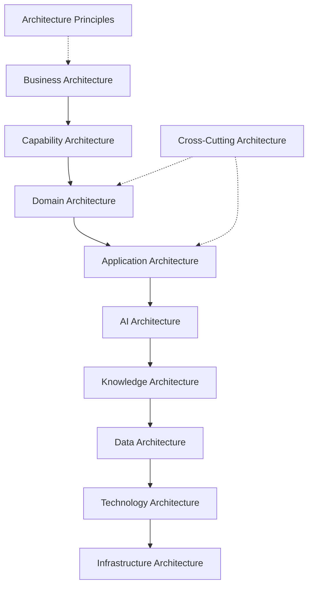

# Enterprise Canvas

The TeamTender Enterprise Canvas provides a holistic, top-down view of our entire architectural ecosystem, demonstrating how business goals translate down to infrastructure.

## Enterprise Architecture Landscape

## Architectural Alignment

The Enterprise Canvas ensures that every line of code written in TeamTender can be traced back to a specific capability within our [Capability Architecture](./Capability-Architecture.md), which in turn serves a core function within our [Business Architecture](./Business-Architecture.md).

The cascading flow from Business down to Infrastructure ensures that technological choices are always driven by business needs and governed by our [Architecture Principles](./Architecture-Principles.md).

For detailed definitions of each module in the canvas, follow the links in the [README](./README.md).
