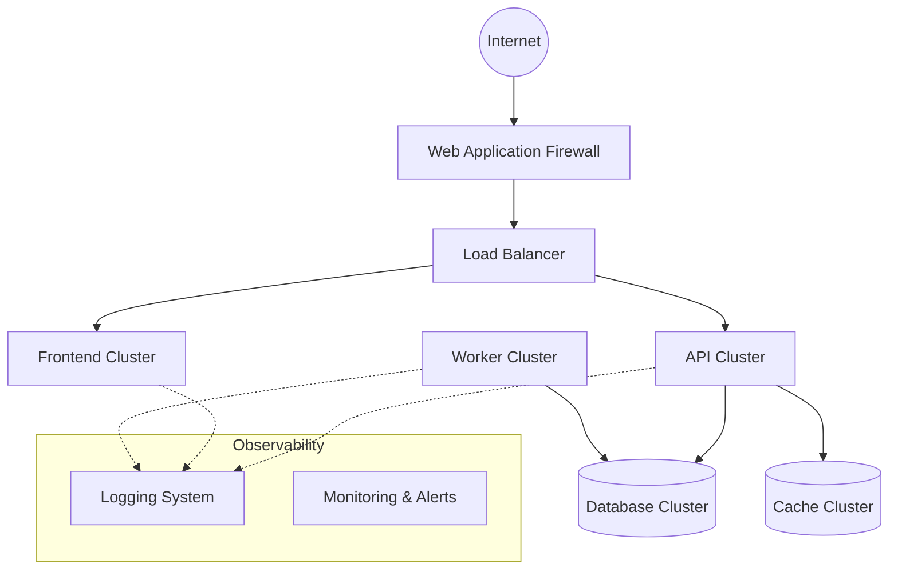

# Infrastructure Architecture

The Infrastructure Architecture defines how TeamTender is deployed, monitored, and maintained in various environments.

## Infrastructure Topology

## Key Components

- **Docker**: All applications and services are containerized using Docker to ensure consistency between development, staging, and production environments.
- **GitHub**: Source code management, issue tracking, and CI/CD pipelines (GitHub Actions) are centralized on GitHub.
- **Deployment**: Automated deployments via CI/CD pipelines. Infrastructure is managed as code (IaC).
- **Logging**: Centralized logging architecture. All services output structured logs (JSON) that are aggregated into a central viewer (e.g., ELK stack, Datadog).
- **Monitoring**: Continuous monitoring of system health, CPU, memory, and application-specific metrics. Automated alerting for critical thresholds.
- **Backup**: Automated, encrypted, and geographically redundant backups for all databases and object storage.
- **Security**: Network isolation (VPCs), firewalls, regular vulnerability scanning, and adherence to least-privilege principles.
