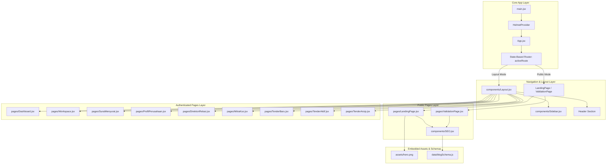

# Technical Architecture Assessment

## Executive Summary
This document delivers a comprehensive technical architecture assessment of the TeamTender web application. The codebase is a client-side Single Page Application (SPA) built with React 19, Vite 8, and Tailwind CSS 4. While the application offers a rich, feature-packed user interface for construction tender management (RAB/BOQ calculation, AHSP PUPR 2025 analysis, KSO partner matching, and document automation), the current architectural implementation suffers from severe monolithic coupling, absence of a service/API layer, custom state-driven navigation, and high file complexity.

## Current Architecture
The current architecture follows a monolithic frontend pattern:
- **Presentation & Logic Co-location**: UI components co-locate presentation templates, static domain datasets, business calculation algorithms, and UI state management inside giant single-file components.
- **State-Based Navigation**: Page switches are handled in `App.jsx` by swapping state (`activeRoute`) rather than utilizing browser URL paths or a router library.
- **Client-Side Data Storage**: Hardcoded mock domain data (AHSP PUPR 2025 libraries, LPSE tender databases, vendor directories, letter templates) is declared directly inside component closures or local module scope.

## Architecture Diagram

## Dependency Analysis

- **Largest Modules**:
  1. `src/pages/Workspace.jsx` (3,357 LOC / 320 KB)
  2. `src/pages/ProfilPerusahaan.jsx` (1,614 LOC / 136 KB)
  3. `src/pages/TenderBaru.jsx` (500 LOC / 36 KB)
  4. `src/pages/SuratMenyurat.jsx` (470 LOC / 34 KB)

- **Most Reused Components**:
  - `lucide-react` icons (imported across all 11 page components).
  - `components/SEO.jsx` (reused across public pages `LandingPage.jsx` and `ValidationPage.jsx`).
  - `components/Sidebar.jsx` (rendered within `Layout.jsx`).

- **Circular Dependencies**:
  - None detected. The component graph is strictly acyclic from `main.jsx` -> `App.jsx` -> `Pages`.

- **Tight Coupling**:
  - `Workspace.jsx` tightly couples BOQ calculation algorithms, AHSP 2025 PUPR lookup tables, Apendo sync simulation, RKK safety plan drafting, and UI rendering into one massive scope.
  - `ProfilPerusahaan.jsx` tightly couples multi-tab document forms (legal, qualifications, equipment, personnel, experience) into a single component scope.

- **High Complexity Files**:
  - `Workspace.jsx`: Cyclomatic complexity > 80 due to multiple nested tabs, modal states, dynamic table arrays, and inline calculation helpers.

## Component Analysis

| Page Name | Imported Components | Number of States | Number of Effects | Estimated Complexity |
|-----------|--------------------|------------------|-------------------|---------------------|
| `LandingPage.jsx` | 5 | 0 | 0 | Low |
| `Dashboard.jsx` | 10 | 0 | 0 | Low |
| `ProfilPerusahaan.jsx` | 12 | 15+ | 0 | High (1,614 LOC) |
| `DirektoriRelasi.jsx` | 10 | 5 | 0 | Medium |
| `MitraKso.jsx` | 10 | 6 | 0 | Medium |
| `TenderBaru.jsx` | 15 | 11 | 0 | High (500 LOC) |
| `TenderAktif.jsx` | 6 | 2 | 0 | Low |
| `TenderArsip.jsx` | 12 | 7 | 1 | Medium-High |
| **`Workspace.jsx`** | **30** | **25+** | **3+** | **Critical / Excessive (3,357 LOC)** |
| `SuratMenyurat.jsx` | 14 | 16 | 1 | High (470 LOC) |
| `ValidationPage.jsx` | 9 | 1 | 1 | Low-Medium |

> **Complexity Warning**: `Workspace.jsx` (3,357 LOC) and `ProfilPerusahaan.jsx` (1,614 LOC) exceed reasonable complexity thresholds for single-file React components by over 5x and 2.5x respectively. They must be decomposed into sub-components during upcoming modernization waves.

## Routing Assessment

- **Current Strategy**: Custom state-based routing inside `src/App.jsx`.
- **Implementation**: A React `useState` hook (`activeRoute`) combined with a `renderPage()` switch-case statement determines which component to render.
- **Deficiencies**:
  - No URL sync: Navigating between workspace tabs or pages does not change the browser address bar.
  - No deep-linking: Users cannot share or bookmark direct URLs to specific workspace tools (e.g. `/workspace/rab` or `/vendor-hub`).
  - No browser history: Using browser Back/Forward buttons exits the SPA instead of stepping backward in application history.

## State Assessment

- **Local State Usage**: 100% of state management is local to individual page components using React's native `useState` hook.
- **Global State Usage**: 0%. There is no external global state store (e.g., Zustand, Redux, or Recoil).
- **Context Usage**: `react-helmet-async`'s `<HelmetProvider>` is the only React Context provider currently wrapping the application in `main.jsx`.

## Service Layer Assessment

- **Assessment Result**: **Mixed / Non-existent**.
- Business logic (such as RAB grand total calculations, coefficient multipliers for AHSP 2025 PUPR, AI draft generator text interpolation, and Apendo sync progress calculations) is directly embedded inside component JSX handlers.
- There are no dedicated service modules (`src/services/`) or API abstraction layers (`src/api/`).

## Maintainability Score: 4/10

**Explanation**:
While the visual aesthetics and feature completeness are high, maintainability is severely hampered by massive single-file components (`Workspace.jsx` > 3.3k lines). Adding or editing features requires scrolling through thousands of lines of co-located code, creating high regression risk and developer friction.

## Scalability Score: 3/10

**Explanation**:
The current state-based routing and embedded hardcoded mockup datasets prevent seamless enterprise backend integration. Transitioning from local state to real REST/GraphQL APIs will require extensive refactoring unless a dedicated service layer and centralized state management are introduced.

## Refactoring Priority

1. **Critical**:
   - Decompose `src/pages/Workspace.jsx` into modular domain sub-components (`/components/workspace/RABTab`, `/components/workspace/AHSPEditor`, `/components/workspace/ApendoSync`, etc.).
   - Extract embedded datasets (AHSP PUPR 2025 coefficients, HSD prices, sample BOQs) out of presentation files into dedicated data services/models.

2. **High**:
   - Decompose `src/pages/ProfilPerusahaan.jsx` into tabbed form components.
   - Introduce a formal declarative router (React Router v7 / TanStack Router) for deep-linking and browser history.

3. **Medium**:
   - Extract business calculation logic (RAB totals, tax calculations, letter text generators) into pure utility functions in `src/utils/` or `src/services/`.
   - Setup a centralized state store (Zustand) for shared user and active tender state.

4. **Low**:
   - Reorganize root node maintenance scripts (`.cjs`) into a `scripts/` directory.

## Risks

1. **Regression Risk**: Refactoring monolithic components without unit test coverage could introduce unintended UI/calculation regressions.
2. **Performance Bottlenecks**: As mock data grows, keeping large arrays in component local state will trigger unnecessary full-tree re-renders.
3. **Collaboration Friction**: Multiple developers editing `Workspace.jsx` simultaneously will face constant git merge conflicts.

## Recommendations

1. **Introduce Modular Component Hierarchy**: Split large pages into smaller sub-components under `src/components/<domain>/`.
2. **Implement Declarative Client-Side Routing**: Replace `activeRoute` string state with standard URL routes.
3. **Establish Service Layer Architecture**: Create `src/services/` for business logic and data fetching handlers.
4. **Implement Unit Testing Baseline**: Integrate `vitest` to protect core calculation functions before initiating refactoring waves.
