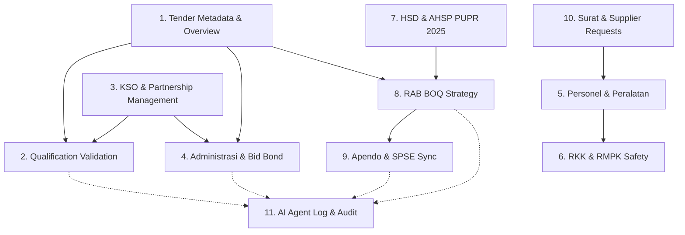

# Workspace Business Domain Analysis

## Executive Summary
This document provides a business domain breakdown of `Workspace.jsx` (3,252 LOC). `Workspace.jsx` serves as the central operational hub for TeamTender, integrating 11 distinct business domains ranging from qualification verification and KSO matching to PUPR 2025 AHSP rate calculation, BOQ strategy adjustment, Apendo encryption, RKK safety planning, and automated document generation.

---

## Domain Breakdown

### 1. Tender Metadata & Overview Domain
- **Purpose**: Tracks high-level tender package metadata (package name, HPS, Pokja, location, deadline) and renders the overview summary dashboard.
- **Current State**: Declared at top of component (`TENDER_METADATA`) and rendered when `subTab === 'overview'`.
- **Main React State**: `subTab` ('overview' | 'permohonan' | 'rab' | 'rkk' | 'schedule').
- **Main Functions**: Standard overview JSX rendering.
- **Dependencies**: `src/modules/workspace/config/metadata.js`.
- **Data Structures**: `{ namaPaket, hps, pokja, lokasi, tglSelesai }`.
- **Estimated LOC**: 120 LOC.
- **Complexity**: Low.
- **Coupling**: Low.
- **Risk**: Low.
- **Recommended Target Module**: `src/modules/workspace/components/OverviewSection.jsx`.

---

### 2. Qualification Validation Center Domain
- **Purpose**: Validates legal and financial qualification documents (NIB, SBU, Akta, NPWP, PKP, KSWP, SPT, BAST) against tender LDP criteria, simulates document verification, and calculates KD (Kemampuan Dasar) & SKP (Sisa Kemampuan Paket).
- **Current State**: Rendered when `subTab === 'kualifikasi'` / `kualifikasiSubTab` ('validation', 'kdskp', 'spse').
- **Main React State**: `docValidation`, `isValidatingAll`, `isKdSkpPrinted`, `isFormulirSaved`.
- **Main Functions**: `handleValidateDoc`, `handleValidateAll`.
- **Dependencies**: `src/modules/workspace/config/fields.js` (`INITIAL_DOC_VALIDATION`).
- **Data Structures**: Document validation map, KD/SKP formula constants.
- **Estimated LOC**: 450 LOC.
- **Complexity**: High.
- **Coupling**: Medium.
- **Risk**: Medium.
- **Recommended Target Module**: `src/modules/workspace/components/KualifikasiTab/`.

---

### 3. KSO & Partnership Management Domain
- **Purpose**: Manages Joint Operation (KSO) profit-loss share splits, KSO partner selection, agreement document uploads, and joint qualification pooling.
- **Current State**: Rendered in both `kualifikasiSubTab === 'kso'` and `adminSubTab === 'kso'`.
- **Main React State**: `selectedKsoPartnerId`, `ksoModalShare`, `ksoShareStatus`, `adminKsoLeaderShare`, `adminKsoMemberShare`, `adminKsoUploadedFile`.
- **Main Functions**: `handleUploadKsoFile`.
- **Dependencies**: `src/modules/workspace/config/options.js` (`INITIAL_KSO_PARTNERS`).
- **Data Structures**: KSO Partner objects, share percentage numbers.
- **Estimated LOC**: 350 LOC.
- **Complexity**: Medium-High.
- **Coupling**: High (shared across Kualifikasi and Administrasi tabs).
- **Risk**: Medium.
- **Recommended Target Module**: `src/modules/workspace/components/KsoSection/`.

---

### 4. Dokumen Administrasi & Bid Bond Domain
- **Purpose**: Generates offer letters, configures bid bond (Jaminan Penawaran) parameters, and simulates AI OCR bank guarantee scanning and validation.
- **Current State**: Rendered when `subTab === 'administrasi'` / `adminSubTab` ('penawaran', 'jaminan').
- **Main React State**: `useApendoLetter`, `adminBidBondRequired`, `adminBidBondPercent`, `adminBidBondDays`, `adminBidBondIssuer`, `adminBidBondUploadedFile`, `adminBidBondAiLogs`, `adminIsScanningBidBond`.
- **Main Functions**: `handleUploadBidBondFile`.
- **Dependencies**: `src/modules/workspace/config/metadata.js`.
- **Data Structures**: Bid bond parameters, verification log objects.
- **Estimated LOC**: 400 LOC.
- **Complexity**: High.
- **Coupling**: Medium.
- **Risk**: Medium.
- **Recommended Target Module**: `src/modules/workspace/components/AdministrasiTab/`.

---

### 5. Dokumen Teknis - Personel & Peralatan Domain
- **Purpose**: Manages technical personnel experience matrix, SKA/SKT assignments, heavy equipment inventory allocation, and ownership proof tracking.
- **Current State**: Rendered when `teknisSubTab === 'personel'` or `teknisSubTab === 'peralatan'`.
- **Main React State**: `personelList`, `selectedPersonelId`, `peralatanList`.
- **Main Functions**: Personnel/equipment CRUD handlers.
- **Dependencies**: `src/modules/workspace/config/options.js` (`INITIAL_PERSONEL_LIST`, `INITIAL_PERALATAN_LIST`).
- **Data Structures**: Personnel and equipment object arrays.
- **Estimated LOC**: 420 LOC.
- **Complexity**: Medium.
- **Coupling**: Low.
- **Risk**: Low.
- **Recommended Target Module**: `src/modules/workspace/components/TeknisTab/PersonelPeralatanSection.jsx`.

---

### 6. Dokumen Teknis - RKK & RMPK Safety Domain
- **Purpose**: Generates Rencana Keselamatan Konstruksi (RKK) & Rencana Mutu Pekerjaan Konstruksi (RMPK), manages IBPRP hazard identification matrix, and provides AI safety drafting.
- **Current State**: Rendered when `teknisSubTab === 'rkk'` or `teknisSubTab === 'rmpk'`.
- **Main React State**: `rkkMenu`, `rmpkMenu`, `rkkData`, `isGeneratingRkk`, `isGeneratingRmpk`.
- **Main Functions**: `triggerRkkGenerate`, `triggerRmpkGenerate`.
- **Dependencies**: Safety hazard guidelines, TOC structures.
- **Data Structures**: RKK hazard tables, TOC sub-menus.
- **Estimated LOC**: 500 LOC.
- **Complexity**: High.
- **Coupling**: Medium.
- **Risk**: High.
- **Recommended Target Module**: `src/modules/workspace/components/TeknisTab/RkkRmpkSection.jsx`.

---

### 7. RAB - HSD & AHSP PUPR 2025 Domain
- **Purpose**: Manages Basic Unit Prices (Harga Satuan Dasar: Labor, Material, Equipment) and PUPR 2025 AHSP unit rate coefficient calculations.
- **Current State**: Rendered when `subTab === 'rab'` / `rabActiveSheet` ('hsd', 'ahsp').
- **Main React State**: `upahList`, `bahanList`, `alatList`, `ahspSearch`, `ahspCategoryFilter`.
- **Main Functions**: `calculateItemBasePrice`, `calculateAhspItemTotal`.
- **Dependencies**: `src/modules/workspace/helpers/workspaceHelpers.js`, `src/modules/workspace/config/options.js`.
- **Data Structures**: HSD price arrays, AHSP coefficient arrays.
- **Estimated LOC**: 380 LOC.
- **Complexity**: High.
- **Coupling**: High (drives BOQ calculations).
- **Risk**: High.
- **Recommended Target Module**: `src/modules/workspace/components/RabTab/HsdAhspSection.jsx`.

---

### 8. RAB - BOQ & Pricing Strategy Domain
- **Purpose**: Bill of Quantities management, percentage markups/reductions, target nominal strategy adjuster, lumpsum item overrides, and Rekapitulasi grand totals.
- **Current State**: Rendered when `subTab === 'rab'` / `rabActiveSheet` ('boq', 'rekap').
- **Main React State**: `boqList`, `pricingStrategy`, `targetPercentage`, `targetNominal`, `useLumpsumOverride`, `profitMargin`, `rabTotal`.
- **Main Functions**: `calculateBoqUnitRate`, `calculateBoqItemTotal`, `calculateBoqGrandTotal`.
- **Dependencies**: `src/modules/workspace/helpers/workspaceHelpers.js`, `src/modules/workspace/config/options.js`.
- **Data Structures**: BOQ item arrays, strategy objects.
- **Estimated LOC**: 450 LOC.
- **Complexity**: Critical / Extremely High.
- **Coupling**: Critical (core calculation hub).
- **Risk**: Critical.
- **Recommended Target Module**: `src/modules/workspace/components/RabTab/BoqStrategySection.jsx`.

---

### 9. RAB - Apendo Encryption & SPSE Sync Domain
- **Purpose**: Simulates Apendo encryption (.rhs/.apendo), submission key generation, and SPSE server sync pipeline.
- **Current State**: Rendered in `rabActiveSheet === 'sync'` and `kualifikasiSubTab === 'spse'`.
- **Main React State**: `isApendoSyncing`, `isSpseFilled`, `isSpseFilling`, `apendoLogs`.
- **Main Functions**: `handleSpseFillBack`, `triggerApendoSync`.
- **Dependencies**: `src/modules/workspace/config/metadata.js`.
- **Data Structures**: Sync logs array, encryption status objects.
- **Estimated LOC**: 250 LOC.
- **Complexity**: Medium.
- **Coupling**: Medium.
- **Risk**: Medium.
- **Recommended Target Module**: `src/modules/workspace/components/RabTab/ApendoSyncSection.jsx`.

---

### 10. Surat Menyurat & Supplier Request Domain
- **Purpose**: Generates official equipment and material support request letters sent to suppliers.
- **Current State**: Rendered when `subTab === 'permohonan'`.
- **Main React State**: `selectedSupplier`, `requestLetterNo`, `requestPreviewText`.
- **Main Functions**: `buildRequestLetterPreviewText`.
- **Dependencies**: `src/modules/workspace/helpers/workspaceHelpers.js`, `src/modules/workspace/config/options.js`.
- **Data Structures**: Supplier options list, letter text string.
- **Estimated LOC**: 180 LOC.
- **Complexity**: Low.
- **Coupling**: Low.
- **Risk**: Low.
- **Recommended Target Module**: `src/modules/workspace/components/SuratSection.jsx`.

---

### 11. AI Agent Log & Audit Trail Domain
- **Purpose**: Real-time agent status updates, automated action logging, and system activity feed.
- **Current State**: Declared at top of `Workspace.jsx` and updated by all validation handlers.
- **Main React State**: `aiLogs`.
- **Main Functions**: `getCurrentLogTime`.
- **Dependencies**: `src/modules/workspace/config/metadata.js`.
- **Data Structures**: Array of `{ time, agent, msg }`.
- **Estimated LOC**: 100 LOC.
- **Complexity**: Low.
- **Coupling**: High (listened to by all other domains).
- **Risk**: Low.
- **Recommended Target Module**: `src/modules/workspace/components/AiAgentLogPanel.jsx`.

---

## Domain Dependency Diagram

---

## Recommended Extraction Order & Risk Ranking

| Extraction Phase | Domain Module | Risk Level | Rationale |
|------------------|---------------|------------|-----------|
| **Phase 2.1** | 1. Overview & Tender Metadata | **Low** | Low coupling, isolated presentation component. |
| **Phase 2.2** | 10. Surat & Supplier Request | **Low** | Self-contained letter preview and supplier select dropdown. |
| **Phase 2.3** | 5. Teknis Personel & Peralatan | **Low** | CRUD lists for equipment and personnel matrix. |
| **Phase 2.4** | 11. AI Agent Log & Audit Panel | **Low-Medium** | Simple state logger panel, but updated by multiple actions. |
| **Phase 2.5** | 9. Apendo Encryption & SPSE Sync | **Medium** | Isolated sync status tab. |
| **Phase 2.6** | 4. Dokumen Administrasi & Bid Bond | **Medium** | Includes OCR scan simulation and bid bond fields. |
| **Phase 2.7** | 3. KSO & Partnership Management | **Medium** | Touches both Kualifikasi and Administrasi tabs. |
| **Phase 2.8** | 2. Qualification Validation Center | **Medium-High** | Contains document validation matrices and KD/SKP checks. |
| **Phase 2.9** | 6. Dokumen Teknis RKK & RMPK | **High** | Complex multi-chapter TOC and hazard identification tables. |
| **Phase 2.10**| 7. RAB HSD & AHSP PUPR 2025 | **High** | Foundation for BOQ pricing calculations. |
| **Phase 2.11**| 8. RAB BOQ & Strategy Engine | **Critical** | Core calculation engine of the entire application. |
