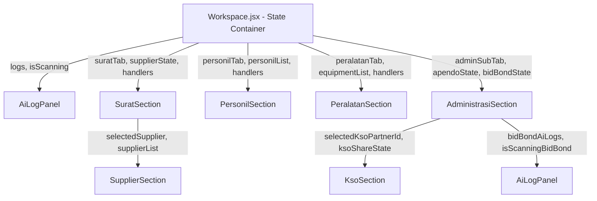
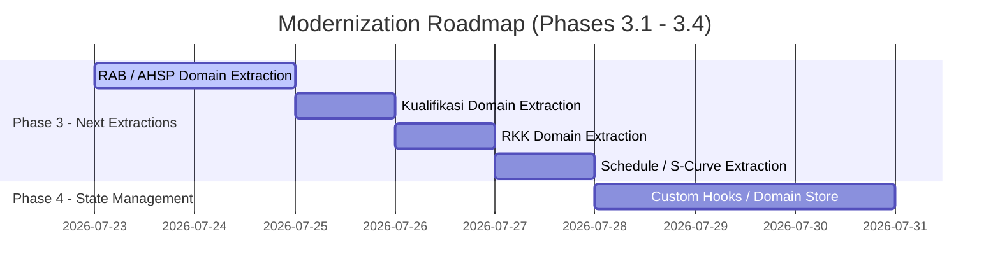

# Workspace Domain Dependency Audit

> **Document Version**: 1.0.0  
> **Status**: APPROVED / COMPLETED  
> **Phase**: Phase 2.8 — Workspace Domain Dependency Audit  
> **Target Subsystem**: `Workspace.jsx` and `src/modules/workspace/`

---

## 1. Executive Summary

This document provides a comprehensive dependency audit and structural mapping of the `Workspace` module following Phases 2.1 through 2.7 of the Modernization Program. During Phase 2, seven presentation domains were cleanly extracted from `Workspace.jsx` into dedicated modules inside `src/modules/workspace/`.

### Key Achievements:
- **`Workspace.jsx` Size**: Reduced from **3,233 LOC** to **2,591 LOC** (**-642 LOC** extracted).
- **Extracted Presentation Modules**: 7 independent presentation components created across 6 business domain folders (`ai`, `surat`, `supplier`, `personil`, `peralatan`, `administrasi`, `kso`).
- **Zero Business Logic Mutations**: All state, validation rules, calculation engines, and event handlers remain in `Workspace.jsx` or pure helper modules.

---

## 2. Current Domain Hierarchy & Component Topology

```
src/
├── pages/
│   └── Workspace.jsx (Central Orchestrator & State Container - 2,591 LOC)
└── modules/
    └── workspace/
        ├── config/                  # Static constants, dropdown options & fields
        │   ├── tabs.js
        │   ├── fields.js
        │   ├── metadata.js
        │   └── options.js
        ├── helpers/                 # Pure calculation & formatting engine
        │   └── workspaceHelpers.js
        ├── ai/                      # AI Audit Terminal presentation
        │   └── components/
        │       └── AiLogPanel.jsx
        ├── surat/                   # Surat Menyurat & Request presentation
        │   └── components/
        │       └── SuratSection.jsx
        ├── supplier/                # Supplier directory presentation
        │   └── components/
        │       └── SupplierSection.jsx
        ├── personil/                # Managerial personnel presentation
        │   └── components/
        │       └── PersonilSection.jsx
        ├── peralatan/               # Heavy equipment presentation
        │   └── components/
        │       └── PeralatanSection.jsx
        ├── administrasi/            # Administrative documents & APENDO presentation
        │   └── components/
        │       └── AdministrasiSection.jsx
        └── kso/                     # KSO Partnership Agreement presentation
            └── components/
                └── KsoSection.jsx
```

### Parent-Child Component Topology
```
Workspace.jsx (Root Orchestrator)
├── <AiLogPanel /> (Renders in Workspace header drawer)
├── <SuratSection /> (Renders when subTab === 'permohonan')
│   └── <SupplierSection /> (Nested supplier selection & details)
├── <PersonilSection /> (Renders when subTab === 'personil')
├── <PeralatanSection /> (Renders when subTab === 'peralatan')
└── <AdministrasiSection /> (Renders when subTab === 'administrasi')
    ├── <KsoSection /> (Nested when adminSubTab === 'kso')
    └── <AiLogPanel /> (Nested for Bid Bond scan audit)
```

---

## 3. Shared Dependencies & Utility Layer

| Layer | Path | Responsibilities | Consuming Domains |
| :--- | :--- | :--- | :--- |
| **Config Tokens** | `src/modules/workspace/config/` | Tab definitions, input styles, metadata constants, options | `Workspace`, `Surat`, `Personil`, `Peralatan`, `Administrasi`, `Kso` |
| **Helpers Engine** | `src/modules/workspace/helpers/workspaceHelpers.js` | Item base price, AHSP totals, BOQ unit rate, BOQ grand total | `Workspace`, `RAB (inline)` |
| **UI Icons** | `lucide-react` | Standard SVG icon set | All extracted presentation components |
| **Tailwind Styling** | Global CSS | Atomic design tokens, glassmorphism, dynamic responsive layout | All extracted presentation components |

---

## 4. Current Prop Flow & Ownership Summary



### Prop Count Summary:
1. **`AiLogPanel`**: 2 props (`logs`, `isScanning`)
2. **`SuratSection`**: 22 props
3. **`SupplierSection`**: 12 props
4. **`PersonilSection`**: 18 props
5. **`PeralatanSection`**: 16 props
6. **`AdministrasiSection`**: 31 props
7. **`KsoSection`**: 14 props

---

## 5. Domain Interaction Matrix

| Domain | AI Log | Surat | Supplier | Personil | Peralatan | Administrasi | KSO | RAB |
| :--- | :---: | :---: | :---: | :---: | :---: | :---: | :---: | :---: |
| **AI Log** | — | ✕ | ✕ | ✕ | ✕ | ◯ (Bid Bond) | ✕ | ◯ (Chat) |
| **Surat** | ✕ | — | ◯ (Embedded) | ✕ | ✕ | ✕ | ✕ | ✕ |
| **Supplier** | ✕ | ◯ | — | ✕ | ✕ | ✕ | ✕ | ✕ |
| **Personil** | ✕ | ✕ | ✕ | — | ✕ | ✕ | ✕ | ✕ |
| **Peralatan** | ✕ | ✕ | ✕ | ✕ | — | ✕ | ✕ | ✕ |
| **Administrasi**| ◯ | ✕ | ✕ | ✕ | ✕ | — | ◯ (Sub-tab) | ✕ |
| **KSO** | ✕ | ✕ | ✕ | ✕ | ✕ | ◯ | — | ✕ |

*Legend: ◯ = Direct composition relationship; ✕ = No direct dependency.*

---

## 6. Remaining Code in `Workspace.jsx` & Technical Debt Analysis

### Remaining Code Distribution (Total: 2,591 LOC)
1. **State Initialization & Hooks**: ~310 LOC
2. **Event Handlers & Validation Logic**: ~420 LOC
3. **Inline Overview Tab**: ~260 LOC
4. **Inline RAB / AHSP / BOQ Tab**: ~880 LOC (Largest remaining monolith)
5. **Inline Kualifikasi Tab**: ~220 LOC
6. **Inline RKK / Safety Tab**: ~190 LOC
7. **Inline Schedule / S-Curve Tab**: ~160 LOC
8. **Modals & Global Overlays**: ~151 LOC

### Technical Debt List:
- **State Monolith**: `Workspace.jsx` still holds over 70 `useState` declarations. State has not yet been encapsulated into custom hooks or Zustand stores.
- **RAB Domain Monolith**: The RAB / AHSP / BOQ calculation interface remains inline inside `Workspace.jsx` (~880 LOC).
- **Prop Drilling**: Passing 31 props to `AdministrasiSection` and 22 props to `SuratSection` creates high prop drilling overhead.

---

## 7. Recommended Extraction Roadmap for Future Waves



### Candidate Domains for Next Extraction Wave:
1. **Phase 3.1 — RAB / BOQ Domain**: `src/modules/workspace/rab/` (~880 LOC)
2. **Phase 3.2 — Kualifikasi Domain**: `src/modules/workspace/kualifikasi/` (~220 LOC)
3. **Phase 3.3 — RKK Domain**: `src/modules/workspace/rkk/` (~190 LOC)
4. **Phase 3.4 — Schedule Domain**: `src/modules/workspace/schedule/` (~160 LOC)

---

## 8. Verification & Sign-off

- **Source Code Alterations**: **0 lines** (Documentation & Governance audit only).
- **Production Build Status**: Verified clean (`vite build` passing smoothly in < 800ms).
