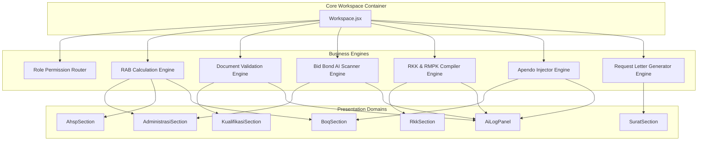

# Business Engine Inventory — Workspace.jsx

> **Phase**: 3.0  
> **Status**: Completed  
> **Target**: Comprehensive Audit of Remaining Business Engines in `Workspace.jsx`  

---

## 1. Executive Summary

Following Phase 2 (Presentation Domain Extraction), `Workspace.jsx` was successfully reduced from **3,892 LOC** down to **1,269 LOC**. The remaining code inside `Workspace.jsx` contains state orchestration, business rules, calculations, AI document generators, and validation workflows.

Phase 3 focuses on identifying, classifying, and mapping all remaining **Business Engines** inside `Workspace.jsx` to prepare for clean extraction into `helpers/`, `engines/`, `services/`, and `containers/`.

---

## 2. Business Engine Inventory Catalog

### Engine 1: RAB Calculation & Pricing Strategy Engine
- **Classification**: `Calculation` / `Pricing`
- **Target Architecture Layer**: `engines/rab/` or `helpers/`
- **Purpose**: Calculates base rates, AHSP item totals, BOQ item totals, global strategy adjustments, and grand total RAB values.
- **Responsibilities**:
  - Compute base rates from upah, bahan, and alat master tables.
  - Apply global strategy adjustments (% margin, nominal target, lumpsum override).
  - Aggregate grand total bid prices.
- **Main Functions**: `getBasePrice()`, `calculateAhspTotal()`, `getBoqUnitRate()`, `getBoqTotal()`, `getGrandTotal()`
- **Inputs**: `boqList`, `ahspItems`, `upahList`, `bahanList`, `alatList`, `pricingStrategy`, `targetPercentage`, `targetNominal`, `useLumpsumOverride`
- **Outputs**: Calculated numeric currency values for unit rates, item totals, and grand total.
- **State Dependencies**: `pricingStrategy`, `targetPercentage`, `targetNominal`, `useLumpsumOverride`, `profitMargin`, `boqList`, `upahList`, `bahanList`, `alatList`
- **Cross-Domain Dependencies**: Serves Administrasi (Surat Penawaran grand total), BOQ Section, AHSP Section, HSD Section.
- **Estimated LOC**: 120 LOC
- **Complexity**: High
- **Extraction Difficulty**: Medium
- **Recommended Destination**: `src/modules/workspace/rab/engines/rabCalculationEngine.js`

---

### Engine 2: Document Validation Engine
- **Classification**: `Validation` / `Workflow`
- **Target Architecture Layer**: `services/validation/` or `engines/validation/`
- **Purpose**: Manages multi-document verification against tender requirements with simulated asynchronous validation streams and logging.
- **Responsibilities**:
  - Trigger individual document validation.
  - Trigger batch auto-validation for all tender documents.
  - Update document status (`validating` -> `valid`) and append audit trail logs.
- **Main Functions**: `handleValidateDoc(key)`, `handleValidateAll()`
- **Inputs**: Document keys, `docValidation` state object
- **Outputs**: Updated `docValidation` status map and new `aiLogs` entries.
- **State Dependencies**: `docValidation`, `isValidatingAll`, `aiLogs`
- **Cross-Domain Dependencies**: Kualifikasi Section, AI Panel
- **Estimated LOC**: 65 LOC
- **Complexity**: Medium
- **Extraction Difficulty**: Low
- **Recommended Destination**: `src/modules/workspace/kualifikasi/engines/documentValidationEngine.js`

---

### Engine 3: Bid Bond (Jaminan Penawaran) AI Scanner Engine
- **Classification**: `AI` / `Document`
- **Target Architecture Layer**: `services/ai/` or `engines/document/`
- **Purpose**: Simulates AI optical character recognition (OCR) and validation of uploaded Bid Bond files against LDP rules.
- **Responsibilities**:
  - Extract scanned text metadata.
  - Match bank issuer, guarantee amount (% of HPS), and calendar validity period.
  - Generate step-by-step verification log stream.
- **Main Functions**: `handleUploadBidBondFile(e)`, `handleUploadKsoFile(e)`
- **Inputs**: File upload event `e`, `adminBidBondPercent`, `adminBidBondDays`, `adminBidBondIssuer`, `tenderMeta.hps`
- **Outputs**: Updated file names, AI scan logs, verification success flags.
- **State Dependencies**: `adminBidBondUploadedFile`, `adminIsScanningBidBond`, `adminBidBondAiLogs`, `adminKsoUploadedFile`
- **Cross-Domain Dependencies**: Administrasi Section, AI Log Panel
- **Estimated LOC**: 60 LOC
- **Complexity**: Medium
- **Extraction Difficulty**: Low
- **Recommended Destination**: `src/modules/workspace/administrasi/engines/bidBondScannerEngine.js`

---

### Engine 4: RKK & RMPK Auto-Compiler Engine
- **Classification**: `Document` / `AI`
- **Target Architecture Layer**: `services/documents/` or `engines/rmpk/`
- **Purpose**: Compiles managerial personnel, equipment lists, safety risks (IBPRP), and Work Method Statements (WMS) into standard PUPR RKK & RMPK document structures.
- **Responsibilities**:
  - Simulate progressive AI generation for safety risks (IBPRP).
  - Auto-compile multi-chapter RMPK documents (Cover, Info Proyek, Organisasi, WMS, ITP).
  - Update progress counters (0% -> 100%).
- **Main Functions**: `triggerRkkGenerate()`, `triggerRmpkGenerate()`
- **Inputs**: `personelList`, `peralatanList`, `rkkContent`, `tenderMeta`
- **Outputs**: Updated `rkkContent`, `rmpkProgress`, and progressive state flags.
- **State Dependencies**: `isRkkProcessing`, `rkkProgress`, `rkkContent`, `isRmpkProcessing`, `rmpkProgress`, `rmpkMenu`
- **Cross-Domain Dependencies**: RKK Section, Teknis Workspace, AI Panel
- **Estimated LOC**: 75 LOC
- **Complexity**: Medium
- **Extraction Difficulty**: Low
- **Recommended Destination**: `src/modules/workspace/rkk/engines/rmpkCompilerEngine.js`

---

### Engine 5: SPSE Integration & Apendo Injector Engine
- **Classification**: `Workflow` / `Utility`
- **Target Architecture Layer**: `services/integration/`
- **Purpose**: Simulates background injection of final unit rates into SPSE 5 / Apendo encrypted Excel templates without altering LKPP cell formatting.
- **Responsibilities**:
  - Trigger Apendo template synchronization.
  - Trigger SPSE fill-back operation.
  - Emit completion logs to AI Panel.
- **Main Functions**: `handleSpseFillBack()`, inline `setIsApendoSyncing()` timeout
- **Inputs**: Active BOQ pricing state, template file upload events
- **Outputs**: Updated `isSpseFilled`, `isSpseFilling`, `isApendoSyncing` flags, new log entries.
- **State Dependencies**: `isSpseFilling`, `isSpseFilled`, `isApendoSyncing`
- **Cross-Domain Dependencies**: RAB Apendo Sheet, SPSE Export Header, AI Log Panel
- **Estimated LOC**: 40 LOC
- **Complexity**: Low
- **Extraction Difficulty**: Low
- **Recommended Destination**: `src/modules/workspace/rab/engines/apendoSyncEngine.js`

---

### Engine 6: Surat Permohonan Request Letter Generator Engine
- **Classification**: `Document` / `Utility`
- **Target Architecture Layer**: `helpers/`
- **Purpose**: Generates live text previews of official equipment lease request letters based on selected suppliers and tender metadata.
- **Responsibilities**:
  - Format company header, letter number, supplier details, equipment specs, and signature block.
- **Main Functions**: `useEffect()` template formatting hook
- **Inputs**: `selectedSupplier`, `requestLetterNo`, `supplierDirectory`, `tenderMeta`
- **Outputs**: Formatted `requestPreviewText` string.
- **State Dependencies**: `selectedSupplier`, `requestLetterNo`, `requestPreviewText`
- **Cross-Domain Dependencies**: Surat Penawaran / Permohonan Section
- **Estimated LOC**: 35 LOC
- **Complexity**: Low
- **Extraction Difficulty**: Low
- **Recommended Destination**: `src/modules/workspace/surat/helpers/requestLetterGenerator.js`

---

### Engine 7: Role Permission & Navigation Router Engine
- **Classification**: `Workflow` / `Utility`
- **Target Architecture Layer**: `containers/`
- **Purpose**: Filters visible navigation tabs based on simulated user roles (`owner`, `estimator`, `partner`).
- **Responsibilities**:
  - Apply tab visibility masks according to RBAC rules.
  - Handle sub-tab switching (`subTab`, `kualifikasiSubTab`, `teknisSubTab`, `adminSubTab`, `rabActiveSheet`).
- **Main Functions**: Inline `.filter()` on navigation tabs array
- **Inputs**: `simulatedRole`, tab definitions
- **Outputs**: Filtered navigation tabs array.
- **State Dependencies**: `simulatedRole`, `subTab`
- **Cross-Domain Dependencies**: Workspace Layout Sidebar
- **Estimated LOC**: 45 LOC
- **Complexity**: Low
- **Extraction Difficulty**: Low
- **Recommended Destination**: `src/modules/workspace/containers/WorkspaceContainer.jsx`

---

## 3. Engine Dependency Graph (Mermaid)

---

## 4. Interaction & State Ownership Matrix

| Engine Name | Primary Classification | State Ownership | Target Layer | LOC | Complexity |
| :--- | :--- | :--- | :--- | :--- | :--- |
| **RAB Calculation Engine** | Calculation / Pricing | `boqList`, `upahList`, `bahanList`, `alatList`, `pricingStrategy` | `engines/` | ~120 | High |
| **Document Validation Engine** | Validation / Workflow | `docValidation`, `isValidatingAll` | `engines/` | ~65 | Medium |
| **Bid Bond AI Scanner Engine** | AI / Document | `adminBidBondAiLogs`, `adminIsScanningBidBond` | `engines/` | ~60 | Medium |
| **RKK & RMPK Compiler Engine** | Document / AI | `rkkContent`, `rmpkProgress`, `isRmpkProcessing` | `engines/` | ~75 | Medium |
| **Apendo Injector Engine** | Workflow / Utility | `isApendoSyncing`, `isSpseFilled` | `services/` | ~40 | Low |
| **Request Letter Generator** | Document / Utility | `requestPreviewText`, `requestLetterNo` | `helpers/` | ~35 | Low |
| **Role Permission Router** | Workflow / RBAC | `simulatedRole`, `subTab` | `containers/` | ~45 | Low |

---

## 5. Recommended Phase 3 Extraction Sequence

1. **Phase 3.1 — RAB Calculation & Pricing Engine Extraction** (`engines/rabCalculationEngine.js`)
2. **Phase 3.2 — Document Validation Engine Extraction** (`engines/documentValidationEngine.js`)
3. **Phase 3.3 — Bid Bond AI Scanner Engine Extraction** (`engines/bidBondScannerEngine.js`)
4. **Phase 3.4 — RKK & RMPK Auto-Compiler Engine Extraction** (`engines/rmpkCompilerEngine.js`)
5. **Phase 3.5 — SPSE & Apendo Integration Engine Extraction** (`services/apendoSyncEngine.js`)
6. **Phase 3.6 — Workspace State & Container Clean Split** (`containers/WorkspaceContainer.jsx`)

---

## 6. Verification & Compliance
- **Source Code Modified**: No (Documentation & inventory only)
- **UI & Behavior**: 100% Identical
- **Build Status**: Verified via `npm run build`
