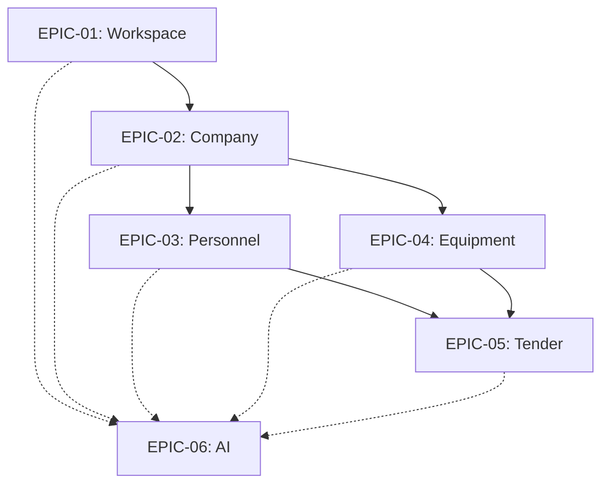

# Dependency Map

## Metadata
- **Document ID:** TT-PROD-DEP-001
- **Version:** 1.0
- **Status:** Approved
- **Owner:** Product Owner
- **Last Updated:** 2026-07-28

## Navigation
- **Previous:** [Sprint Plan](./Sprint-Plan.md)
- **Next:** None
- **Parent:** [Product README](./README.md)
- **Related Documents:** [Epic Roadmap](./Epic-Roadmap.md)

## Epic Dependencies
The following diagram illustrates the architectural and product dependencies across the Wave 6 Epics. 

*Note: Solid lines indicate structural dependencies (e.g., Personnel require a Company). Dotted lines indicate intelligence layer dependencies (AI augments all layers).*
