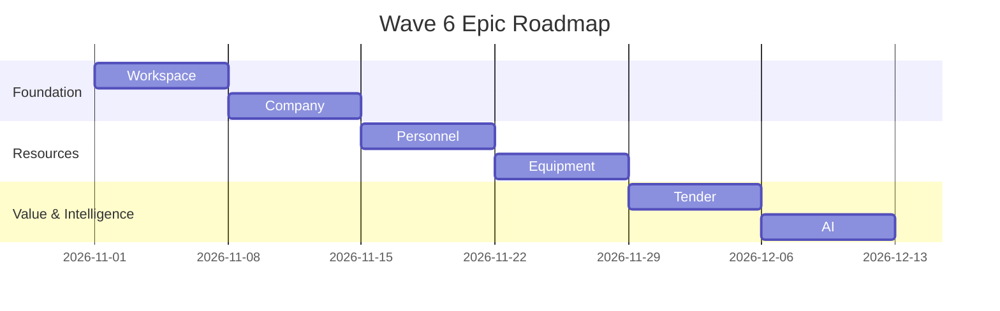

# Epic Roadmap

## Metadata
- **Document ID:** TT-PROD-RDMP-001
- **Version:** 1.0
- **Status:** Approved
- **Owner:** Product Owner
- **Last Updated:** 2026-07-28

## Navigation
- **Previous:** [MVP Scope](./MVP-Scope.md)
- **Next:** [Epic Backlog](./Epic-Backlog.md)
- **Parent:** [Product README](./README.md)
- **Related Documents:** [Program Roadmap](../program-management/Program-Roadmap.md)

## Epic Delivery Sequence
The Wave 6 roadmap strictly follows the approved dependency hierarchy to ensure a stable foundation before layering complex business logic and AI features.

1. **Phase 1: Foundation (Sprints 1-2)**
   - EPIC-01: Workspace
   - EPIC-02: Company
2. **Phase 2: Resources (Sprints 3-4)**
   - EPIC-03: Personnel
   - EPIC-04: Equipment
3. **Phase 3: Core Value & Intelligence (Sprints 5-6)**
   - EPIC-05: Tender
   - EPIC-06: AI
4. **Phase 4: Launch Readiness (Sprints 7-10)**
   - Integration, Stabilization, UAT, and MVP Release Candidate.

