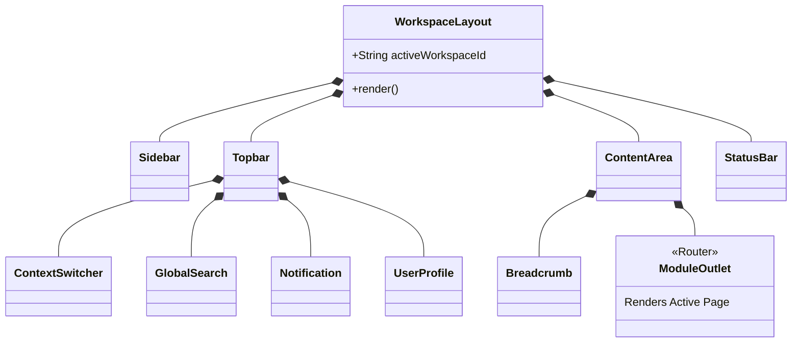

# Frontend Layout Composition

## Metadata
- **Document ID:** TT-PROD-WS-FLC-001
- **Version:** 1.0
- **Status:** Review
- **Owner:** Frontend Lead
- **Last Updated:** 2026-07-28

## Component Hierarchy

## Layout Elements
1. **WorkspaceLayout**: The main wrapper. Provides React Context for `CurrentWorkspace`.
2. **Sidebar**: Dynamic navigation links based on user RBAC permissions within the active workspace.
3. **Topbar**: Houses the global search bar, the workspace context switcher (dropdown), notifications, and user profile.
4. **ContentArea**: The scrollable main region.
5. **Breadcrumb**: Path indicator derived dynamically from `react-router` useLocation.
6. **StatusBar**: Fixed bottom bar showing environment status, AI extraction queue, and system health.
