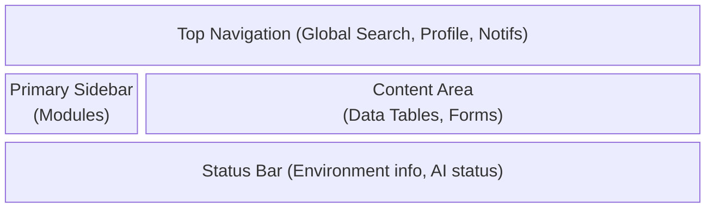

# Layout Standards

## Metadata
- **Document ID:** TT-PROD-WS-LAY-001
- **Version:** 1.0
- **Status:** Approved
- **Owner:** Product Owner
- **Last Updated:** 2026-07-28

## Navigation
- **Previous:** [User Flows](./User-Flows.md)
- **Next:** [Role & Permission Model](./Role-Permission-Model.md)
- **Parent:** [Workspace README](./README.md)
- **Related Documents:** None

## Overall Layout structure
The Workspace layout utilizes a standard enterprise SaaS shell, optimized for data density and spatial memory.

## Sidebar (Left)
- **Width:** 240px (expanded), 64px (collapsed).
- **Behavior:** Sticky to the left edge. Scrollable independently if menus exceed viewport height.
- **Content:** Workspace Switcher (top), Primary Navigation Links (Company, Tender, etc.), Settings (bottom).

## Top Navigation
- **Height:** 64px.
- **Behavior:** Sticky to the top.
- **Content:** Breadcrumbs (left), Global Search (center), Notifications & User Profile Menu (right).

## Content Area
- **Behavior:** Main scrollable region. Uses max-width constraints (e.g., 1440px) on ultra-wide monitors to maintain readability.
- **Padding:** 24px standard padding around cards and tables.

## Status Bar (Bottom)
- **Height:** 32px.
- **Content:** System status, version number, active environment (Dev/Prod), AI processing queues.

## Responsive Behaviour

### Desktop (>= 1024px)
- Sidebar is permanently visible (expanded by default).
- Multi-column forms and dense data grids.

### Tablet (768px - 1023px)
- Sidebar collapses to icons only (64px width).
- Data tables drop non-essential columns or convert to card views.

### Mobile (< 768px)
- Sidebar is hidden behind a hamburger menu in the Top Navigation.
- Top Navigation search collapses to an icon.
- Content area switches entirely to vertical card layouts. Forms stack vertically.
