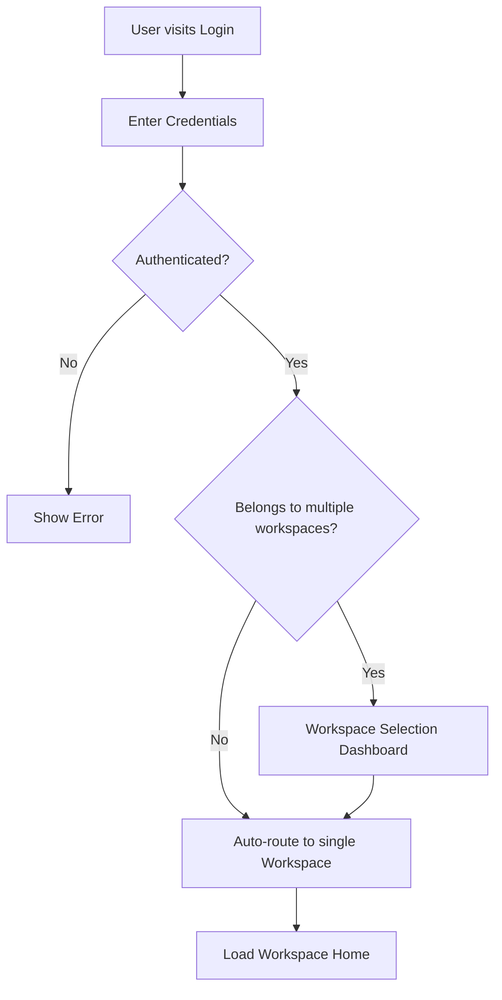
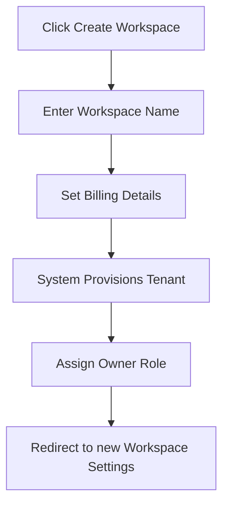
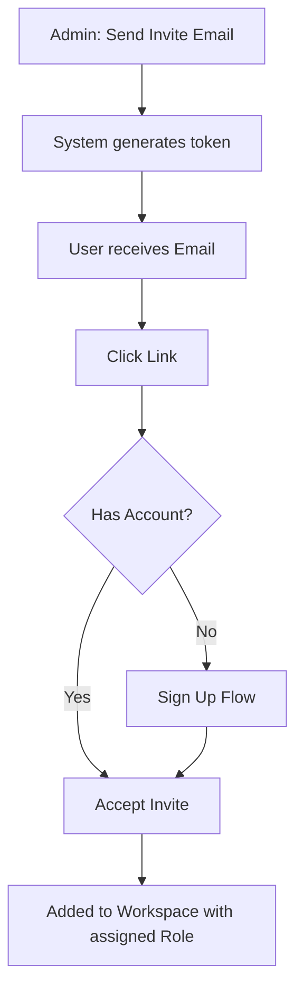
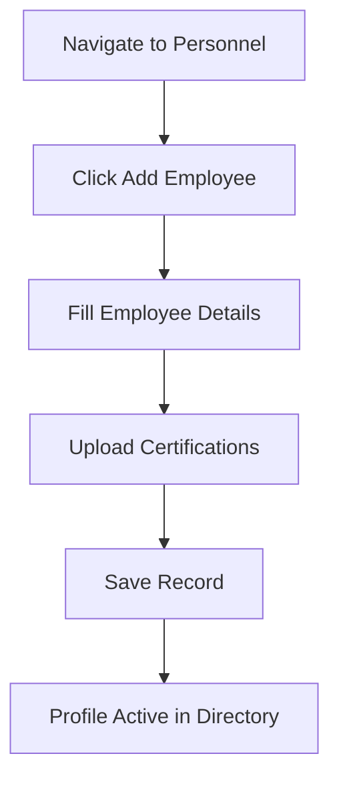
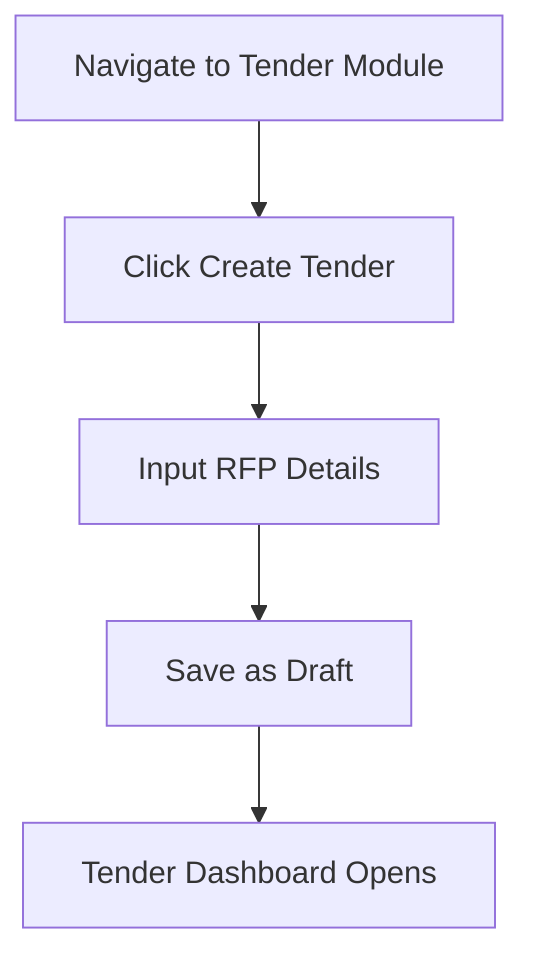
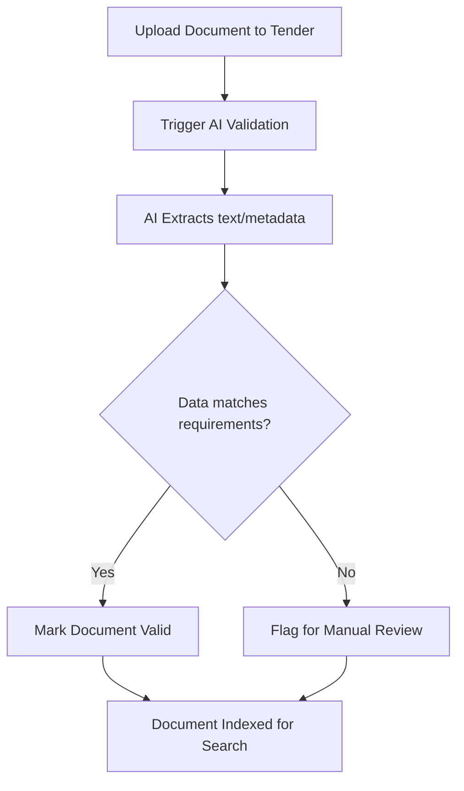
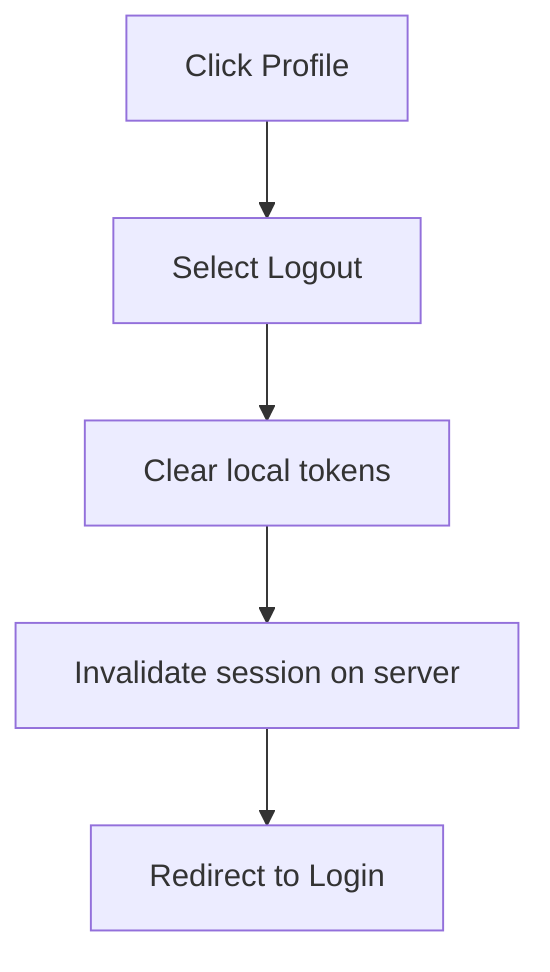

# User Flows

## Metadata
- **Document ID:** TT-PROD-WS-FLW-001
- **Version:** 1.0
- **Status:** Approved
- **Owner:** Product Owner
- **Last Updated:** 2026-07-28

## Navigation
- **Previous:** [Workspace Modules](./Workspace-Modules.md)
- **Next:** [Layout Standards](./Layout-Standards.md)
- **Parent:** [Workspace README](./README.md)
- **Related Documents:** None

## Core User Journeys

### 1. Login and Workspace Selection

### 2. Create Workspace

### 3. Invite Member and Accept Invitation

### 4. Create Personnel

### 5. Open Tender

### 6. Search Document & AI Validation

### 7. Logout

