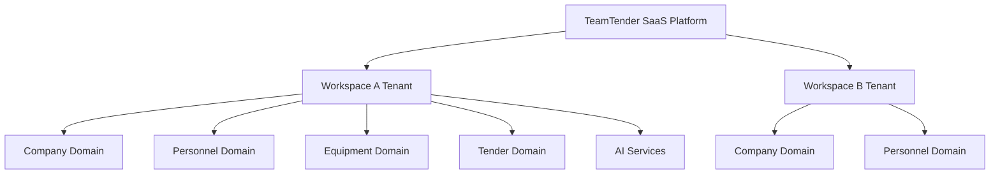

# Workspace Information Architecture

## Metadata
- **Document ID:** TT-PROD-WS-IA-001
- **Version:** 1.0
- **Status:** Approved
- **Owner:** Product Owner
- **Last Updated:** 2026-07-28

## Navigation
- **Previous:** [Workspace README](./README.md)
- **Next:** [Navigation Model](./Navigation-Model.md)
- **Parent:** [Workspace README](./README.md)
- **Related Documents:** [Enterprise Architecture](../../engineering-blueprint/Enterprise-Architecture/README.md)

## Purpose
To define the structural foundation of the TeamTender Workspace, establishing clear rules for data isolation, component placement, and overall user interaction models to ensure a secure, scalable, and intuitive enterprise SaaS experience.

## Architecture Principles
1. **Tenant Isolation:** A workspace is a hard boundary. No data leaks between workspaces.
2. **Contextual Intelligence:** UI adapts based on user roles and current workspace configurations.
3. **Frictionless Navigation:** Operations must be logically grouped by domains (Company, Personnel, Equipment, Tender).
4. **AI-Native Surfaces:** AI interactions are deeply embedded in context, not just bolted on as chatbots.

## Enterprise Hierarchy

## Workspace Concept
A Workspace is the digital representation of a customer's environment. It hosts their specific organizational data, assets, users, and tenders. Every interaction a user performs is scoped to the active workspace they are operating within.

## Workspace Boundaries
- **Data Boundary:** All primary keys and foreign keys resolve securely via the `workspaceId`.
- **Authentication Boundary:** A user's token is stamped with their authorized workspaces and roles.
- **Resource Boundary:** Billing, storage limits, and API quotas are calculated per workspace.

## Workspace Container Model
The Workspace Container houses modules corresponding to the official Epics (Company, Personnel, Equipment, Tender, AI) and shared configuration panels (Settings, Billing, Members).

## Workspace Navigation Philosophy
Navigation is structured progressively. Global controls manage workspace selection and user profile settings, while contextual sidebars manage domain-specific operations within the selected workspace.

## Workspace Guardrails
- Users cannot access routes outside of an active workspace context (except for the workspace selection dashboard).
- "All Data" views only roll up data strictly within the current workspace boundary.
