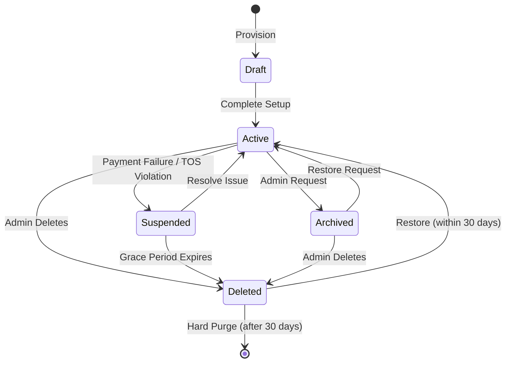

# Workspace State Model

## Metadata
- **Document ID:** TT-PROD-WS-STAT-001
- **Version:** 1.0
- **Status:** Approved
- **Owner:** Product Owner
- **Last Updated:** 2026-07-28

## Navigation
- **Previous:** [Workspace Lifecycle](./Workspace-LifeCycle.md)
- **Next:** [Workspace Glossary](./Workspace-Glossary.md)
- **Parent:** [Workspace README](./README.md)
- **Related Documents:** None

## State Definitions

- **Draft:** Workspace is created but essential configuration (e.g., Company profile) is incomplete.
- **Active:** Fully operational. Billing is active. Users can Read/Write.
- **Suspended:** Temporary lock due to billing failure or Terms of Service violation. Read-only or No Access.
- **Archived:** Voluntarily locked by the user. Read-only for historical auditing.
- **Deleted:** Soft-deleted state. Waiting for hard purge.

## State Transition Diagram

