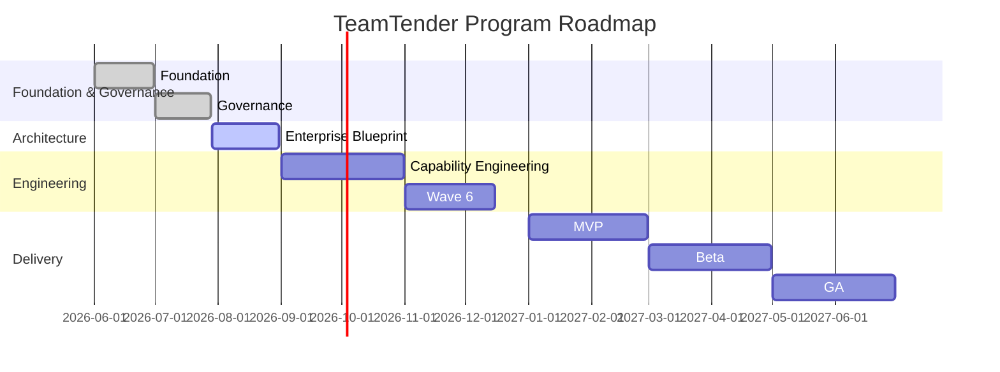

# Program Roadmap

## Metadata
- **Document ID:** TT-PR-001
- **Version:** 1.0
- **Status:** Approved
- **Owner:** Founder
- **Last Updated:** 2026-07-28

## Navigation
- **Previous:** [Milestones](./Milestones.md)
- **Next:** [Deliverables](./Deliverables.md)
- **Parent:** [Program Management README](./README.md)
- **Related Documents:** [Milestones](./Milestones.md)

## Timeline Overview
Foundation ↓ Governance ↓ Enterprise Blueprint ↓ Capability Engineering ↓ Wave 6 ↓ MVP ↓ Beta ↓ GA

## Roadmap Gantt Chart

