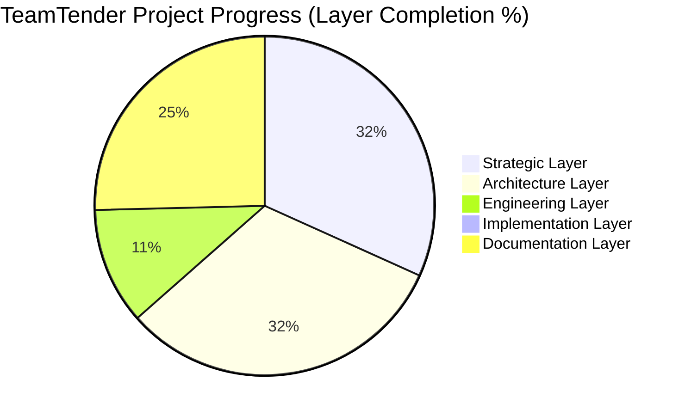

# Progress Dashboard

## Metadata
- **Document ID:** TT-PROG-001
- **Version:** 1.0
- **Status:** Approved
- **Owner:** Founder
- **Last Updated:** 2026-07-28

## Navigation
- **Previous:** [Deliverables](./Deliverables.md)
- **Next:** None
- **Parent:** [Program Management README](./README.md)
- **Related Documents:** [Master Program Plan](./Master-Program-Plan.md)

## Overall Completion Dashboard

- **Overall Project:** 35%
- **Strategic Layer:** 100%
- **Architecture Layer:** 100%
- **Engineering Layer:** 35%
- **Implementation Layer:** 0%
- **Documentation Layer:** 80%

## Progress Pie Chart

