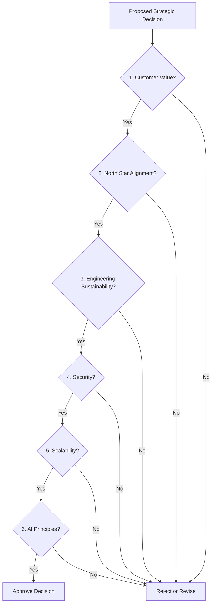

# Strategic Decision Framework

## Metadata
- **Document ID:** TT-DF-001
- **Version:** 1.0
- **Status:** Approved
- **Owner:** Founder
- **Last Updated:** 2026-07-28

## Navigation
- **Previous:** [Strategic Principles](./Strategic-Principles.md)
- **Next:** None
- **Parent:** [Strategy README](./README.md)
- **Related Documents:** [North Star](./North-Star.md)

## Decision Process
Every strategic decision must satisfy the following criteria:
1. Customer Value
2. North Star Alignment
3. Engineering Sustainability
4. Security
5. Scalability
6. AI Principles

## Decision Flow Diagram

